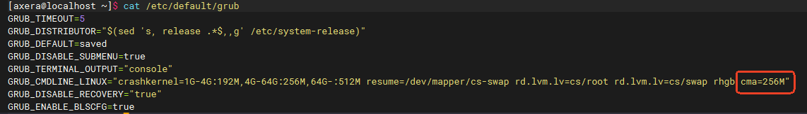
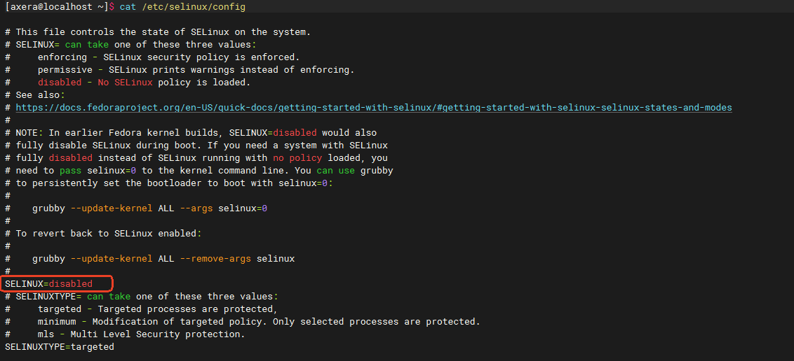
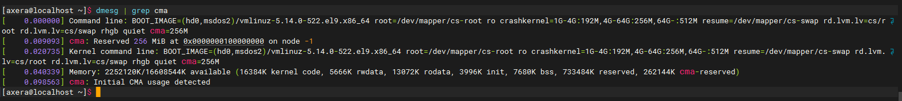
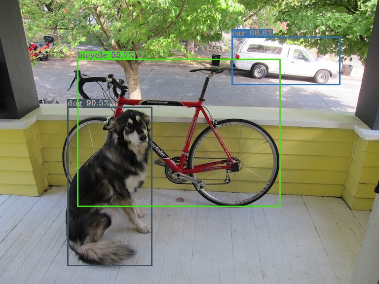
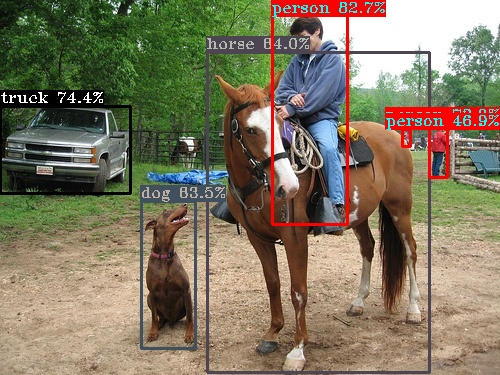

# AXCL 快速上手

## 安装

### Raspberry Pi 5

### CentOS 9

#### 系统信息

参考环境的 CentOS 9 环境如下：

```bash
[axera@localhost ~]$ uname -a
Linux localhost.localdomain 5.14.0-522.el9.x86_64 #1 SMP PREEMPT_DYNAMIC Sun Oct 20 13:04:34 UTC 2024 x86_64 x86_64 x86_64 GNU/Linux
[axera@localhost ~]$ 
[axera@localhost ~]$ uname -r
5.14.0-522.el9.x86_64
[axera@localhost ~]$ 
[axera@localhost ~]$ cat /etc/os-release 
NAME="CentOS Stream"
VERSION="9"
ID="centos"
ID_LIKE="rhel fedora"
VERSION_ID="9"
PLATFORM_ID="platform:el9"
PRETTY_NAME="CentOS Stream 9"
ANSI_COLOR="0;31"
LOGO="fedora-logo-icon"
CPE_NAME="cpe:/o:centos:centos:9"
HOME_URL="https://centos.org/"
BUG_REPORT_URL="https://issues.redhat.com/"
REDHAT_SUPPORT_PRODUCT="Red Hat Enterprise Linux 9"
REDHAT_SUPPORT_PRODUCT_VERSION="CentOS Stream"
```
#### 环境搭建

1. `sudo yum update`  更新软件包

2. `sudo yum install -y kernel-devel kernel-headers`

3. 修改 `grub` 文件添加 `reserved cma size` （转码卡建议256MB）

   ```bash
   [axera@localhost ~]$ cat /etc/default/grub
   GRUB_TIMEOUT=5
   GRUB_DISTRIBUTOR="$(sed 's, release .*$,,g' /etc/system-release)"
   GRUB_DEFAULT=saved
   GRUB_DISABLE_SUBMENU=true
   GRUB_TERMINAL_OUTPUT="console"
   GRUB_CMDLINE_LINUX="crashkernel=1G-4G:192M,4G-64G:256M,64G-:512M resume=/dev/mapper/cs-swap rd.lvm.lv=cs/root rd.lvm.lv=cs/swap rhgb cma=256M"
   GRUB_DISABLE_RECOVERY="true"
   GRUB_ENABLE_BLSCFG=true
   ```

   

4. 更新 `grub`

   ```bash
   sudo su
   grub2-mkconfig -o /boot/grub2/grub.cfg
   grub2-editenv - set "$(grub2-editenv - list | grep kernelopts) cma=256M"
   grubby --update-kernel=ALL --args="cma=256M"
   ```

5. 关闭 `SELinux`

   ```bash
   [axera@localhost ~]$ cat /etc/selinux/config
   
   # This file controls the state of SELinux on the system.
   # SELINUX= can take one of these three values:
   #     enforcing - SELinux security policy is enforced.
   #     permissive - SELinux prints warnings instead of enforcing.
   #     disabled - No SELinux policy is loaded.
   # See also:
   # https://docs.fedoraproject.org/en-US/quick-docs/getting-started-with-selinux/#getting-started-with-selinux-selinux-states-and-modes
   #
   # NOTE: In earlier Fedora kernel builds, SELINUX=disabled would also
   # fully disable SELinux during boot. If you need a system with SELinux
   # fully disabled instead of SELinux running with no policy loaded, you
   # need to pass selinux=0 to the kernel command line. You can use grubby
   # to persistently set the bootloader to boot with selinux=0:
   #
   #    grubby --update-kernel ALL --args selinux=0
   #
   # To revert back to SELinux enabled:
   #
   #    grubby --update-kernel ALL --remove-args selinux
   #
   SELINUX=disabled
   # SELINUXTYPE= can take one of these three values:
   #     targeted - Targeted processes are protected,
   #     minimum - Modification of targeted policy. Only selected processes are protected.
   #     mls - Multi Level Security protection.
   SELINUXTYPE=targeted
   ```

   

6. 安装 `make`, `gcc`, `patch`, `rpm-build`

   ```bash
   sudo yum install -y patch
   sudo yum install -y rpm-build
   ```

7. 重启 `reboot`

8. `dmesg |  grep cma` 查看 `CMA reserved` 是否成功

   ```bash
   [axera@localhost ~]$ dmesg | grep cma
   [    0.000000] Command line: BOOT_IMAGE=(hd0,msdos2)/vmlinuz-5.14.0-522.el9.x86_64 root=/dev/mapper/cs-root ro crashkernel=1G-4G:192M,4G-64G:256M,64G-:512M resume=/dev/mapper/cs-swap rd.lvm.lv=cs/root rd.lvm.lv=cs/swap rhgb quiet cma=256M
   [    0.009093] cma: Reserved 256 MiB at 0x0000000100000000 on node -1
   [    0.020735] Kernel command line: BOOT_IMAGE=(hd0,msdos2)/vmlinuz-5.14.0-522.el9.x86_64 root=/dev/mapper/cs-root ro crashkernel=1G-4G:192M,4G-64G:256M,64G-:512M resume=/dev/mapper/cs-swap rd.lvm.lv=cs/root rd.lvm.lv=cs/swap rhgb quiet cma=256M
   [    0.040339] Memory: 2252120K/16608544K available (16384K kernel code, 5666K rwdata, 13072K rodata, 3996K init, 7680K bss, 733484K reserved, 262144K cma-reserved)
   [    0.098563] cma: Initial CMA usage detected
   ```

   

#### `AXCL` `rpm` 安装

rpm 的安装分为 2 个步骤：将 **src.rpm** 源码编译成二进制的 rpm，然后安装 rpm。

> [!IMPORTANT]
>
> 因安装后将自动加载设备固件，因此安装前请确认子卡已和主机正确连接。

1. 源码安装:

    源码使用命令进行安装：`rpm -Uvh axcl_host-V2.16.0_20241111020148-NO4430.src.rpm`

   ```bash
   [axera@localhost]$ rpm -Uvh axcl_host-V2.16.0_20241111020148-NO4430.src.rpm
   Updating / installing...
      1:axcl_host-V2.16.0_20241111020148-warning: user jenkins does not exist - using root
   warning: group jenkins does not exist - using root
   warning: user jenkins does not exist - using root
   warning: group jenkins does not exist - using root
   ################################# [100%]
   ```

2. 源码安装完之后，在 `/home/user` 目录可以找到 **rmpbuild** 目录（如果是 sudo，目录在 `/root` 下）

    ```bash
    [axera@localhost ~]$ ls
    Desktop  Documents  Downloads  jingxiaoping  mp4  Music  Pictures  Public  rpmbuild  Templates  Videos
    ```

3. 构建 rpm 安装包：

    使用命令 `rpmbuild -bb --nodebuginfo rpmbuild/SPECS/axcl_host.spec` 进行构建：

   ```bash
   [axera@localhost rpmbuild]$ rpmbuild -bb --nodebuginfo SPECS/axcl_host.spec
   warning: bogus date in %changelog: Thu Oct 30 2024 root <root@localhost> - 1.0-1
   setting SOURCE_DATE_EPOCH=1730246400
   Executing(%prep): /bin/sh -e /var/tmp/rpm-tmp.qShrCO
   + umask 022
   + cd /home/axera/rpmbuild/BUILD
   + cd /home/axera/rpmbuild/BUILD
   + rm -rf axcl
   + /usr/bin/gzip -dc /home/axera/rpmbuild/SOURCES/axcl.tar.gz
   + /usr/bin/tar -xof -
   + STATUS=0
   + '[' 0 -ne 0 ']'
   + cd axcl
   + /usr/bin/chmod -Rf a+rX,u+w,g-w,o-w .
   ++ cat /etc/os-release
   ++ grep '^VERSION_ID='
   ++ cut -d = -f2
   ++ tr -d '"'
   + os_version=9
   ++ cat /etc/os-release
   ++ grep '^NAME='
   ++ cut -d = -f2
   ++ tr -d '"'
   + os_name='CentOS Stream'
   + [[ CentOS Stream == \C\e\n\t\O\S\ \S\t\r\e\a\m ]]
   + [[ 9 == \9 ]]
   + echo 'Apply patch for centos stream 9'
   Apply patch for centos stream 9
   + cd /home/axera/rpmbuild/BUILD/axcl/drv/pcie/driver
   + patch -p3
   patching file include/ax_pcie_dev.h
   patching file net/rc-net/ax_pcie_net.c
   + RPM_EC=0
   ++ jobs -p
   + exit 0
   Executing(%build): /bin/sh -e /var/tmp/rpm-tmp.l1AJjV
   + umask 022
   + cd /home/axera/rpmbuild/BUILD
   + cd axcl
   + cd /home/axera/rpmbuild/BUILD/axcl/drv/pcie/driver
   + make host=x86 clean all install -j8
   + RPM_EC=0
   ++ jobs -p
   + exit 0
   Executing(%install): /bin/sh -e /var/tmp/rpm-tmp.xiLHDC
   ... ...
   Checking for unpackaged file(s): /usr/lib/rpm/check-files /home/axera/rpmbuild/BUILDROOT/axcl_host-1.0-1.el9.x86_64
   Wrote: /home/axera/rpmbuild/RPMS/x86_64/axcl_host-1.0-1.el9.x86_64.rpm
   Executing(%clean): /bin/sh -e /var/tmp/rpm-tmp.a78fQ2
   + umask 022
   + cd /home/axera/rpmbuild/BUILD
   + cd axcl
   + /usr/bin/rm -rf /home/axera/rpmbuild/BUILDROOT/axcl_host-1.0-1.el9.x86_64
   + RPM_EC=0
   ++ jobs -p
   + exit 0
   ```

4. 安装 rpm：

    使用命令 `sudo rpm -Uvh --nodeps rpmbuild/RPMS/x86_64/axcl_host-1.0-1.el9.x86_64.rpm` 安装，参考如下：
    
   ```bash
   [axera@localhost rpmbuild]$ sudo rpm -Uvh --nodeps RPMS/x86_64/axcl_host-1.0-1.el9.x86_64.rpm
   [sudo] password for axera:
   Verifying...                          ################################# [100%]
   Preparing...                          ################################# [100%]
   Updating / installing...
      1:axcl_host-1.0-1.el9              ################################# [100%]
   [axera@localhost rpmbuild]$
   ```

5. 加载环境：`source /etc/profile`
    加载环境是为了使 `/usr/lib/axcl/` 下安装的可执行程序可以直接运行；还可以通过断开 `ssh` 重连的方式更新 ssh 环境。下列目录是 rpm 包安装的主要内容：

   ```bash
   [axera@localhost axcl]$ ls  /usr/lib/axcl/
   ffmpeg                libaxcl_ive.so      libaxcl_npu.so          libaxcl_pkg.so     libaxcl_skel.debug   libaxcl_vdec.debug  libspdlog.so.1.14.1
   libaxcl_comm.debug    libaxcl_ivps.debug  libaxcl_pcie_dma.debug  libaxcl_ppl.debug  libaxcl_skel.so      libaxcl_vdec.so
   libaxcl_comm.so       libaxcl_ivps.so     libaxcl_pcie_dma.so     libaxcl_ppl.so     libaxcl_sys.debug    libaxcl_venc.debug
   libaxcl_dmadim.debug  libaxcl_lite.debug  libaxcl_pcie_msg.debug  libaxcl_proto.a    libaxcl_sys.so       libaxcl_venc.so
   libaxcl_dmadim.so     libaxcl_lite.so     libaxcl_pcie_msg.so     libaxcl_rt.debug   libaxcl_token.debug  libspdlog.so
   libaxcl_ive.debug     libaxcl_npu.debug   libaxcl_pkg.debug       libaxcl_rt.so      libaxcl_token.so     libspdlog.so.1.14
   [axera@localhost axcl]$ ls  /usr/bin/axcl/
   axcl_demo       axcl_sample_dmadim  axcl_sample_ivps    axcl_sample_runtime  axcl_sample_sys        axcl_sample_vdec  axcl_smi  launch_transcode.sh
   axcl_run_model  axcl_sample_ive     axcl_sample_memory  axcl_sample_skel     axcl_sample_transcode  axcl_sample_venc  data      ut
   [axera@localhost axcl]$
   ```

#### rpm 卸载

rpm 包卸载后会自动 reset 子卡，子卡会进入 `pcie download mode`。卸载命令如下：
```bash
sudo rpm -e axcl_host
```

### Others

## 模型 benchmark

`AXCL` 安装完毕后，模型跑分的工具 `axcl_run_model` 就可以使用了。该工具参数较多，可以用 `axcl_run_model --help` 查看可用的参数；如果对其实现机制感兴趣，还可以检查对应的 `sample` 目录中的源码。该工具和其他 `cv & llm sample` 一起，是源码形式提供的，以便于用户理解 `API` 的用法。

以测试一个模型的运行速度为例，使用 `axcl_run_model -m your_model.axmodel -r 100` 这样的形式 `-m` 指定要跑的模型，`-r` 指定重复次数，即可简单的跑测模型的速度。

```bash
/root # axcl_run_model -m yolov5s.axmodel -r 100
   Run AxModel:
         model: /opt/data/npu/models/yolov5s.axmodel
          type: 1 Core
          vnpu: Disable
        warmup: 1
        repeat: 100
         batch: { auto: 1 }
    axclrt ver: 1.0.0
   pulsar2 ver: 1.2-patch2 7e6b2b5f
      tool ver: 0.0.1
      cmm size: 12730188 Bytes
  ---------------------------------------------------------------------------
  min =   7.793 ms   max =   7.929 ms   avg =   7.804 ms  median =   7.799 ms
   5% =   7.796 ms   90% =   7.808 ms   95% =   7.832 ms     99% =   7.929 ms
  ---------------------------------------------------------------------------

```

从以上运行示例可见，从运行结果看，除了能指示模型运行时间外，还能指示工具链版本、模型类型等信息。

## CV 示例

### 分类模型

分类模型的示例代码含完整注释如下：
```c++
#include "common/args.hpp"            // 包含分割令行参数的头文件
#include "common/types.hpp"           // 包含常用类型定义的头文件
#include "common/sampler.hpp"         // 包含图像预处理的头文件
#include "common/topk.hpp"            // 包含获取 Top K 类别的函数
#include "common/imagenet.hpp"        // 包含 ImageNet 数据集的类别定义

#include "utilities/timer.hpp"        // 包含计时器类
#include "utilities/file.hpp"         // 包含文件操作的工具函数
#include "utilities/scalar_guard.hpp" // 包含资源管理类，确保资源的释放
#include "utilities/vector_guard.hpp" // 包含动态数组的资源管理类

#include <axcl.h>                     // AXCL API 头文件
#include <cmdline.h>                  // 命令行解析库
#include <opencv2/opencv.hpp>         // OpenCV 图像处理库

// 设置默认配置文件路径
constexpr char  DEFAULT_CONFIG[] = "/usr/local/axcl/axcl.json";

// 设置默认输入图像的高度和宽度
constexpr int   DEFAULT_IMG_H = 224;
constexpr int   DEFAULT_IMG_W = 224;

// 设置默认循环次数
constexpr int   DEFAULT_LOOP_COUNT = 1;

// 设置默认 Top K 值
constexpr int   DEFAULT_TOP_K = 5;

int main(int argc, char* argv[]) {
    cmdline::parser cmd; // 创建命令行解析器

    // 添加命令行参数
    cmd.add<std::string>("config", 'c', "config file: axcl.json", false, DEFAULT_CONFIG); // 配置文件路径
    cmd.add<int>("device", 'd', "device index (if multi-card available)", false, 0, cmdline::range(0, 3)); // 设备索引

#if defined(ENV_CHIP_SERIES_MC50)
    cmd.add<int>("kind", 'k', "visual npu kind", false, 0, cmdline::range(0, 3)); // NPU 类型
#endif

#if defined(ENV_CHIP_SERIES_MC20E)
    cmd.add<int>("kind", 'k', "visual npu enable flag", false, 0, cmdline::range(0, 1)); // NPU 启用标志
#endif

    cmd.add<std::string>("model", 'm', "model file(a.k.a. .axmodel)", true, ""); // 必填参数，模型文件
    cmd.add<std::string>("image", 'i', "image file", true, ""); // 必填参数，图像文件
    cmd.add<std::string>("size", 'g', "input_h,input_w", false, std::to_string(DEFAULT_IMG_H) + "," + std::to_string(DEFAULT_IMG_W)); // 输入图像大小

    cmd.add("swap-rb", 's', "swap rgb(bgr) to bgr(rgb)"); // 可选参数，是否交换颜色通道

    cmd.add<int>("topk", 't', "top k values", false, DEFAULT_TOP_K, cmdline::range(1, static_cast<int>(std::size(IMAGENET_CLASSES)))); // Top K 值
    cmd.add<int>("repeat", 'r', "repeat count", false, DEFAULT_LOOP_COUNT, cmdline::range(1, std::numeric_limits<int>::max())); // 重复次数
    cmd.parse_check(argc, argv); // 解析命令行参数并进行检查

    // 0-0. 检查配置文件
    if (const auto config = cmd.get<std::string>("config");
        cmd.exist("config") && (!utilities::exists(config) || !utilities::is_regular_file(config))) {
        fprintf(stderr, "Config file %s is not exist, please check it.\n", config.c_str()); // 输出错误信息
        return -1; // 退出程序
    }

    // 0-1. 检查模型和图像文件是否存在
    const auto model_file = cmd.get<std::string>("model");
    const auto image_file = cmd.get<std::string>("image");

    if (const auto model_file_flag = utilities::exists(model_file), image_file_flag = utilities::exists(image_file);
        !model_file_flag | !image_file_flag) {
        auto show_error = [](const std::string& kind, const std::string& value) {
            fprintf(stderr, "Input file %s(%s) is not exist, please check it.\n", kind.c_str(), value.c_str());
        };

        if (!model_file_flag) { show_error("model", model_file); } // 输出模型文件不存在的错误
        if (!image_file_flag) { show_error("image", image_file); } // 输出图像文件不存在的错误

        return -1; // 退出程序
    }

    // 0-2. 获取输入图像大小
    std::array<int, 2> input_size = {DEFAULT_IMG_H, DEFAULT_IMG_W}; {
        auto input_size_string = cmd.get<std::string>("size");
        if (auto input_size_flag = common::parse_args(input_size_string, input_size); !input_size_flag) {
            auto show_error = [](const std::string& kind, const std::string& value) {
                fprintf(stderr, "Input %s(%s) is not allowed, please check it.\n", kind.c_str(), value.c_str());
            };

            show_error("size", input_size_string); // 输出输入大小错误
            return -1; // 退出程序
        }
    }

    // 0-3. 获取重复次数
    auto repeat = cmd.get<int>("repeat");

    // 1-0. 获取设备索引
    const auto device_index = static_cast<uint32_t>(cmd.get<int>("device"));

    // 1-1 初始化 AXCL，使用 scalar_guard 确保资源最终释放
    fprintf(stdout, "axcl initializing...\n");
    auto env_guard = utilities::scalar_guard<int32_t>(
        axclInit(cmd.exist("config") ? cmd.get<std::string>("config").c_str() : nullptr), // 初始化 AXCL
        [](const int32_t& code) {
            if (0 == code) {
                std::ignore = axclFinalize(); // 确保在初始化失败时调用清理
            }
        }
    );

    // 1-2. 检查初始化结果
    if (const int ret = env_guard.get(); 0 != ret) {
        fprintf(stderr, "Init axcl failed{0x%08X}.\n", ret); // 输出初始化失败的信息
        return false; // 退出程序
    }
    fprintf(stdout, "axcl inited.\n");

    // 1-3. 获取设备列表
    axclrtDeviceList lst;
    if (const auto ret = axclrtGetDeviceList(&lst); 0 != ret || 0 == lst.num) {
        fprintf(stderr,
            "Get axcl device failed{0x%08X}, find total %d device.\n", ret, lst.num); // 输出获取设备失败的信息
        return false; // 退出程序
    }

    // 1-4. 检查设备索引
    if (device_index >= lst.num) {
        fprintf(stderr,
            "Specified device index{%u} is out of range{total %d}.\n", device_index, lst.num); // 输出设备索引超出范围的信息
        return false; // 退出程序
    }

    // 1-5. 设置设备
    if (const auto ret = axclrtSetDevice(lst.devices[device_index]); 0 != ret) {
        fprintf(stderr, "Set axcl device as index{%u} failed{0x%08X}.\n", device_index, ret); // 输出设置设备失败的信息
        return false; // 退出程序
    }
    fprintf(stdout,"Select axcl device{index: %u} as {%d}.\n", device_index, lst.devices[device_index]);

    // 1-6. 初始化 NPU
    const int kind = cmd.get<int>("kind"); // 获取 NPU 类型
    if (const int ret = axclrtEngineInit(static_cast<axclrtEngineVNpuKind>(kind)); 0 != ret) {
        fprintf(stderr, "Init axclrt Engine as kind{%s} failed{0x%08X}.\n", common::get_visual_mode_string(kind).c_str(), ret); // 输出初始化 NPU 失败的信息
        return false; // 退出程序
    }
    fprintf(stdout, "axclrt Engine inited.\n");

    // 1-7. 打印参数信息
    fprintf(stdout, "--------------------------------------\n");
    fprintf(stdout, "model file : %s\n", model_file.c_str());
    fprintf(stdout, "image file : %s\n", image_file.c_str());
    fprintf(stdout, "img height : %d\n", input_size[0]);
    fprintf(stdout, "img width  : %d\n", input_size[1]);
    fprintf(stdout, "--------------------------------------\n");

    // 2-1. 加载模型
    auto m = utilities::scalar_guard<uint64_t>(
        [&model_file]() {
            if (uint64_t id; 0 == axclrtEngineLoadFromFile(model_file.c_str(), &id)) { // 从文件加载模型
                return id; // 返回模型 ID
            }
            fprintf(stderr, "Create model{%s} handle failed.\n", model_file.c_str());
            return uint64_t{0}; // 返回 0 表示失败
        },
        [](const uint64_t& id) {
            if (uint64_t{0} != id) {
                std::ignore = axclrtEngineUnload(id); // 卸载模型
            }
        }
    );

    // 2-2. 创建上下文
    uint64_t ctx = 0;
    if (const auto ret = axclrtEngineCreateContext(m.get(), &ctx); 0 != ret) {
        fprintf(stderr, "Create model{%s} context failed.\n", model_file.c_str()); // 输出创建上下文失败的信息
        return false; // 退出程序
    }

    // 2-3. 获取 IO 信息
    auto info = utilities::scalar_guard<axclrtEngineIOInfo>(
        [&m]() {
            axclrtEngineIOInfo i;
            if (0 == axclrtEngineGetIOInfo(m.get(), &i)) {
                return i; // 返回 IO 信息
            }
            fprintf(stderr, "Get model io info failed.\n");
            return axclrtEngineIOInfo{}; // 返回空结构体表示失败
        },
        [](const axclrtEngineIOInfo& i) {
            std::ignore = axclrtEngineDestroyIOInfo(i); // 释放 IO 信息
        }
    );

    // 2-4. 创建 IO
    auto io = utilities::scalar_guard<axclrtEngineIO>(
        [&info]() {
            axclrtEngineIO i;
            if (0 == axclrtEngineCreateIO(info.get(), &i)) {
                return i; // 返回创建的 IO
            }
            fprintf(stderr, "Create model io failed.\n");
            return axclrtEngineIO{}; // 返回空结构体表示失败
        },
        [](const axclrtEngineIO& i) {
            std::ignore = axclrtEngineDestroyIO(i); // 释放 IO
        }
    );

    // 2-5. 获取输入数量
    uint32_t input_count = 0;
    if (input_count = axclrtEngineGetNumInputs(info.get()); 0 == input_count) {
        fprintf(stderr, "Get model input count failed.\n"); // 输出获取输入数量失败的信息
        return false; // 退出程序
    }

    // 2-6. 获取输入大小
    std::vector<uint32_t> inputs_size(input_count, 0);
    for (uint32_t i = 0; i < input_count; i++) {
        inputs_size[i] = axclrtEngineGetInputSizeByIndex(info.get(), 0, i); // 获取每个输入的大小
    }

    // 2-7. 分配输入内存
    auto inputs = utilities::vector_guard<void*>(
        [&input_count, &inputs_size]() {
            std::vector<void*> ptrs(input_count, nullptr);
            for (uint32_t i = 0; i < input_count; i++) {
                if (const auto ret = axclrtMalloc(&ptrs[i], inputs_size[i], axclrtMemMallocPolicy{}); 0 != ret) {
                    fprintf(stderr, "Memory allocation for input tensor{index: %d} failed{0x%08X}.\n", i, ret); // 输出内存分配失败的信息
                }
            }
            return ptrs; // 返回分配的内存指针数组
        },
        [](void* ptr) {
            if (nullptr != ptr) {
                std::ignore = axclrtFree(ptr); // 释放内存
                ptr = nullptr;
            }
        }
    );

    // 2-8. 检查输入内存是否分配成功
    for (uint32_t i = 0; i < input_count; i++) {
        if (nullptr == inputs.get()[i]) {
            return false; // 退出程序
        }
    }

    // 2-9. 设置输入缓冲区
    for (uint32_t i = 0; i < input_count; i++) {
        if (const auto ret = axclrtEngineSetInputBufferByIndex(io.get(), i, inputs.get()[i], inputs_size[i]); 0 != ret) {
            fprintf(stderr, "Set input buffer{index: %d} failed{0x%08X}.\n", i, ret); // 输出设置输入缓冲区失败的信息
            return false; // 退出程序
        }
    }

    // 2-10. 获取输出数量
    uint32_t output_count = 0;
    if (output_count = axclrtEngineGetNumOutputs(info.get()); 0 == output_count) {
        fprintf(stderr, "Get model output count failed.\n"); // 输出获取输出数量失败的信息
        return false; // 退出程序
    }

    // 2-11. 获取输出大小
    std::vector<uint32_t> outputs_size(output_count, 0);
    for (uint32_t i = 0; i < output_count; i++) {
        outputs_size[i] = axclrtEngineGetOutputSizeByIndex(info.get(), 0, i); // 获取每个输出的大小
    }

    // 2-12. 分配输出内存
    auto outputs = utilities::vector_guard<void*>(
        [&output_count, &outputs_size]() {
            std::vector<void*> ptrs(output_count, nullptr);
            for (uint32_t i = 0; i < output_count; i++) {
                if (const auto ret = axclrtMalloc(&ptrs[i], outputs_size[i], axclrtMemMallocPolicy{}); 0 != ret) {
                    fprintf(stderr, "Memory allocation for output tensor{index: %d} failed{0x%08X}.\n", i, ret); // 输出内存分配失败的信息
                }
            }
            return ptrs; // 返回分配的内存指针数组
        },
        [](void* ptr) {
            if (nullptr != ptr) {
                std::ignore = axclrtFree(ptr); // 释放内存
                ptr = nullptr;
            }
        }
    );

    // 2-13. 检查输出内存是否分配成功
    for (uint32_t i = 0; i < output_count; i++) {
        if (nullptr == outputs.get()[i]) {
            return false; // 退出程序
        }
    }

    // 2-14. 设置输出缓冲区
    for (uint32_t i = 0; i < output_count; i++) {
        if (const auto ret = axclrtEngineSetOutputBufferByIndex(io.get(), i, outputs.get()[i], outputs_size[i]); 0 != ret) {
            fprintf(stderr, "Set output buffer{index: %d} failed{0x%08X}.\n", i, ret); // 输出设置输出缓冲区失败的信息
            return false; // 退出程序
        }
    }

    // 3-0. 读取输入图像
    cv::Mat src = cv::imread(image_file);
    if (src.empty()) {
        fprintf(stderr, "Read image failed.\n"); // 输出读取图像失败的信息
        return -1; // 退出程序
    }

    // 3-1. 分配输入主机缓冲区
    std::vector<uint8_t> input_buffer(input_size[1] * input_size[0] * 3, 0); // 分配输入缓冲区（RGB）
    auto dst = cv::Mat(cv::Size(input_size[1], input_size[0]), CV_8UC3, input_buffer.data()); // 创建 OpenCV Mat 结构

    // 3-2. 预处理图像（调整大小和交换 RGB 通道）
    preprocess::sampler sampler(preprocess::crop_type::imagenet, preprocess::resize_type::linear, cmd.exist("swap-rb"));
    sampler(src, dst); // 对输入图像进行处理

    // 3-3. 将输入数据发送到设备
    if (const auto ret = axclrtMemcpy(inputs.get()[0], input_buffer.data(), input_buffer.size(), AXCL_MEMCPY_HOST_TO_DEVICE); 0 != ret) {
        fprintf(stderr, "Copy input data to device failed{0x%08X}.\n", ret); // 输出数据复制失败的信息
        return false; // 退出程序
    }

    // 3-4. 执行模型推理
    std::vector<float> time_costs(repeat, 0); // 记录每次推理的时间
    for (int i = 0; i < repeat; ++i) {
        utilities::timer tick; // 创建计时器
        const auto ret = axclrtEngineExecute(m.get(), ctx, 0, io.get()); // 执行推理
        time_costs[i] = tick.elapsed(); // 记录推理时间
        if ( 0 != ret) {
            fprintf(stderr, "Run model failed{0x%08X}.\n", ret); // 输出推理失败的信息
            return false; // 退出程序
        }
    }

    // 3-5. 获取输出结果
    std::vector<float> output_buffer(outputs_size[0], 0.f); // 初始化输出缓冲区
    if (const auto ret = axclrtMemcpy(output_buffer.data(), outputs.get()[0], outputs_size[0], AXCL_MEMCPY_DEVICE_TO_HOST); 0 != ret) {
        fprintf(stderr, "Copy output data to host failed{0x%08X}.\n", ret); // 输出数据复制失败的信息
        return false; // 退出程序
    }

    // 3-6. 后处理，提取检测结果
    const auto topK = classification::topK(output_buffer.data(), output_buffer.size(), cmd.get<int>("topk")); // 获取 Top K 结果
    for (const auto& [prob, index] : topK) {
        fprintf(stdout, "%3d: %4.1f%%,  %s\n", index, prob, IMAGENET_CLASSES[index]); // 输出每个类别的概率和名称
    }
    fprintf(stdout, "--------------------------------------\n");

    return 0; // 正常结束程序
}
```

以 [`imagenet`](https://image-net.org/) 数据集的 `imagenet_cat.jpg` 作为分类对象，`sample` 执行完了会有如下输出(注意，模型和输入图像要根据实际情况微调)：


```bash
/root # /opt/bin/axcl/axcl_sample_classification -m /opt/data/npu/models/mobilenetv2.axmodel -i /opt/data/npu/images/cat.jpg
axcl initializing...
axcl inited.
Select axcl device{index: 0} as {129}.
axclrt Engine inited.
--------------------------------------
model file : /opt/data/npu/models/mobilenetv2.axmodel
image file : /opt/data/npu/images/cat.jpg
img height : 224
img width  : 224
--------------------------------------
282:  9.8%,  tiger cat
285:  9.8%,  Egyptian cat
283:  9.5%,  Persian cat
281:  9.4%,  tabby, tabby cat
463:  7.5%,  bucket, pail
--------------------------------------
```

可见菊猫 Top1 被分类为老虎猫；Top5 分类基本正确。

### 检测模型

检测模型的示例代码含完整注释如下：
```c++
#include "common/args.hpp"            // 包含分割令行参数的头文件
#include "common/types.hpp"           // 包含常用类型定义的头文件
#include "common/sampler.hpp"         // 包含图像预处理的头文件
#include "common/detection.hpp"       // 包含目标检测相关的数据结构和算法
#include "common/mscoco.hpp"          // 包含 MS COCO 数据集的类别定义
#include "common/palette.hpp"         // 包含调色板生成和颜色转换的函数

#include "utilities/timer.hpp"        // 包含计时器类，用于测量时间
#include "utilities/file.hpp"         // 包含文件操作的工具函数
#include "utilities/scalar_guard.hpp" // 包含资源管理类，确保资源的释放
#include "utilities/vector_guard.hpp" // 包含动态数组的资源管理类

#include <axcl.h>                     // AXCL API 头文件

#include <cmdline.h>                  // 命令行解析库
#include <opencv2/opencv.hpp>         // OpenCV 图像处理库

#include <algorithm>                  // 包含算法函数
#include <numeric>                    // 包含数值计算函数

// 设置默认配置文件路径
constexpr char  DEFAULT_CONFIG[] = "/usr/local/axcl/axcl.json";

// 设置默认输入图像的高度和宽度
constexpr int   DEFAULT_IMG_H = 640;
constexpr int   DEFAULT_IMG_W = 640;
// 设置默认的概率阈值和 IOU 阈值
constexpr float DEFAULT_PROB_THRESHOLD = 0.45f;
constexpr float DEFAULT_IOU_THRESHOLD = 0.45f;

// 设置默认循环次数
constexpr int   DEFAULT_LOOP_COUNT = 1;

// 定义锚框
const std::vector<std::vector<detection::box>> anchors{
    {{10, 13}, {16, 30}, {33, 23}},
    {{30, 61}, {62, 45}, {59, 119}},
    {{116, 90}, {156, 198}, {373, 326}}
};

// 定义模型输出头下采样的步幅
const std::vector<int> strides{8, 16, 32};
// 生成颜色调色板
std::vector<cv::Vec3b> palette = common::palette(std::size(MSCOCO_CLASSES));

// 绘制检测到的对象
static void draw_objects(const cv::Mat& bgr, const std::string& name, const std::vector<detection::object>& objects) {
    // 克隆输入图像以便绘制
    cv::Mat image = bgr.clone();

    // 遍历检测到的每个对象
    for (const auto& [rect, prob, label] : objects) {
        const auto& [x, y, w, h] = rect; // 提取矩形的坐标和大小
        fprintf(stdout, "%2d: %3.0f%%, [%4.0f, %4.0f, %4.0f, %4.0f], %s\n",
            label, prob * 100, x, y, x + w, y + h, MSCOCO_CLASSES[label]); // 输出对象信息

        const cv::Rect obj_rect{static_cast<int>(x), static_cast<int>(y), static_cast<int>(w), static_cast<int>(h)}; // 创建矩形对象

        const auto& color = palette[label]; // 获取该对象的颜色
        cv::rectangle(image, obj_rect, color, 2); // 在图像上绘制矩形框

        char text[256];
        sprintf(text, "%s %.1f%%", MSCOCO_CLASSES[label], prob * 100); // 准备显示的文本

        // 计算文本位置
        int baseLine = 0;
        const cv::Size label_size = cv::getTextSize(text, cv::FONT_HERSHEY_TRIPLEX, 0.5, 1, &baseLine);

        int cv_x = std::max(static_cast<int>(x - 1), 0); // 确保文本不会超出图像边界
        int cv_y = std::max(static_cast<int>(y + 1) - label_size.height - baseLine, 0);

        if (cv_x + label_size.width > image.cols) {
            cv_x = image.cols - label_size.width; // 调整文本 x 坐标
        }
        if (cv_y + label_size.height > image.rows) {
            cv_y = image.rows - label_size.height; // 调整文本 y 坐标
        }

        // 绘制文本背景
        const cv::Size text_background_size(label_size.width, label_size.height + baseLine);
        const cv::Rect text_background(cv::Point(cv_x, cv_y), text_background_size);
        cv::rectangle(image, text_background, color, -1); // 绘制填充矩形

        const cv::Point text_origin(cv_x, cv_y + label_size.height); // 文本的起始位置
        const auto text_color = common::get_complementary_color(color); // 获取对比色
        cv::putText(image, text, text_origin, cv::FONT_HERSHEY_TRIPLEX, 0.5, text_color); // 在图像上绘制文本
    }

    // 将结果图像保存为文件
    cv::imwrite(std::string(name) + ".jpg", image);
}

int main(int argc, char* argv[]) {
    cmdline::parser cmd; // 创建命令行解析器

    // 添加命令行参数
    cmd.add<std::string>("config", 'c', "config file: axcl.json", false, DEFAULT_CONFIG);
    cmd.add<int>("device", 'd', "device index (if multi-card available)", false, 0, cmdline::range(0, 3));

#if defined(ENV_CHIP_SERIES_MC50)
    cmd.add<int>("kind", 'k', "visual npu kind", false, 0, cmdline::range(0, 3));
#endif

#if defined(ENV_CHIP_SERIES_MC20E)
    cmd.add<int>("kind", 'k', "visual npu enable flag", false, 0, cmdline::range(0, 1));
#endif

    cmd.add<std::string>("model", 'm', "model file(a.k.a. .axmodel)", true, ""); // 必填参数，模型文件
    cmd.add<std::string>("image", 'i', "image file", true, ""); // 必填参数，图像文件
    cmd.add<std::string>("size", 'g', "input_h,input_w", false, std::to_string(DEFAULT_IMG_H) + "," + std::to_string(DEFAULT_IMG_W)); // 输入图像大小

    cmd.add("swap-rb", 's', "swap rgb(bgr) to bgr(rgb)"); // 可选参数，是否交换颜色通道

    cmd.add<int>("repeat", 'r', "repeat count", false, DEFAULT_LOOP_COUNT, cmdline::range(1, std::numeric_limits<int>::max())); // 重复次数
    cmd.parse_check(argc, argv); // 解析命令行参数并进行检查

    // 0-0. 检查配置文件
    if (const auto config = cmd.get<std::string>("config");
        cmd.exist("config") && (!utilities::exists(config) || !utilities::is_regular_file(config))) {
        fprintf(stderr, "Config file %s is not exist, please check it.\n", config.c_str()); // 输出错误信息
        return -1; // 退出程序
    }

    // 0-1. 检查模型和图像文件是否存在
    const auto model_file = cmd.get<std::string>("model");
    const auto image_file = cmd.get<std::string>("image");

    if (const auto model_file_flag = utilities::exists(model_file), image_file_flag = utilities::exists(image_file);
        !model_file_flag | !image_file_flag) {
        auto show_error = [](const std::string& kind, const std::string& value) {
            fprintf(stderr, "Input file %s(%s) is not exist, please check it.\n", kind.c_str(), value.c_str());
        };

        if (!model_file_flag) { show_error("model", model_file); } // 输出模型文件不存在的错误
        if (!image_file_flag) { show_error("image", image_file); } // 输出图像文件不存在的错误

        return -1; // 退出程序
    }

    // 0-2. 获取输入图像大小
    std::array<int, 2> input_size = {DEFAULT_IMG_H, DEFAULT_IMG_W}; {
        auto input_size_string = cmd.get<std::string>("size");
        if (auto input_size_flag = common::parse_args(input_size_string, input_size); !input_size_flag) {
            auto show_error = [](const std::string& kind, const std::string& value) {
                fprintf(stderr, "Input %s(%s) is not allowed, please check it.\n", kind.c_str(), value.c_str());
            };

            show_error("size", input_size_string); // 输出输入大小错误
            return -1; // 退出程序
        }
    }

    // 0-3. 获取重复次数
    auto repeat = cmd.get<int>("repeat");

    // 1-0. 获取设备索引
    const auto device_index = static_cast<uint32_t>(cmd.get<int>("device"));

    // 1-1 初始化 AXCL，使用 scalar_guard 确保资源最终释放
    fprintf(stdout, "axcl initializing...\n");
    auto env_guard = utilities::scalar_guard<int32_t>(
        axclInit(cmd.exist("config") ? cmd.get<std::string>("config").c_str() : nullptr), // 初始化 AXCL
        [](const int32_t& code) {
            if (0 == code) {
                std::ignore = axclFinalize(); // 确保在初始化失败时调用清理
            }
        }
    );

    // 1-2. 检查初始化结果
    if (const int ret = env_guard.get(); 0 != ret) {
        fprintf(stderr, "Init axcl failed{0x%08X}.\n", ret); // 输出初始化失败的信息
        return false; // 退出程序
    }
    fprintf(stdout, "axcl inited.\n");

    // 1-3. 获取设备列表
    axclrtDeviceList lst;
    if (const auto ret = axclrtGetDeviceList(&lst); 0 != ret || 0 == lst.num) {
        fprintf(stderr,
            "Get axcl device failed{0x%08X}, find total %d device.\n", ret, lst.num); // 输出获取设备失败的信息
        return false; // 退出程序
    }

    // 1-4. 检查设备索引
    if (device_index >= lst.num) {
        fprintf(stderr,
            "Specified device index{%u} is out of range{total %d}.\n", device_index, lst.num); // 输出设备索引超出范围的信息
        return false; // 退出程序
    }

    // 1-5. 设置设备
    if (const auto ret = axclrtSetDevice(lst.devices[device_index]); 0 != ret) {
        fprintf(stderr, "Set axcl device as index{%u} failed{0x%08X}.\n", device_index, ret); // 输出设置设备失败的信息
        return false; // 退出程序
    }
    fprintf(stdout,"Select axcl device{index: %u} as {%d}.\n", device_index, lst.devices[device_index]);

    // 1-6. 初始化 NPU
    const int kind = cmd.get<int>("kind"); // 获取 NPU 类型
    if (const int ret = axclrtEngineInit(static_cast<axclrtEngineVNpuKind>(kind)); 0 != ret) {
        fprintf(stderr, "Init axclrt Engine as kind{%s} failed{0x%08X}.\n", common::get_visual_mode_string(kind).c_str(), ret); // 输出初始化 NPU 失败的信息
        return false; // 退出程序
    }
    fprintf(stdout, "axclrt Engine inited.\n");

    // 1-7. 打印参数信息
    fprintf(stdout, "--------------------------------------\n");
    fprintf(stdout, "model file : %s\n", model_file.c_str());
    fprintf(stdout, "image file : %s\n", image_file.c_str());
    fprintf(stdout, "img height : %d\n", input_size[0]);
    fprintf(stdout, "img width  : %d\n", input_size[1]);
    fprintf(stdout, "--------------------------------------\n");

    // 2-1. 加载模型
    auto m = utilities::scalar_guard<uint64_t>(
        [&model_file]() {
            if (uint64_t id; 0 == axclrtEngineLoadFromFile(model_file.c_str(), &id)) { // 从文件加载模型
                return id; // 返回模型 ID
            }
            fprintf(stderr, "Create model{%s} handle failed.\n", model_file.c_str());
            return uint64_t{0}; // 返回 0 表示失败
        },
        [](const uint64_t& id) {
            if (uint64_t{0} != id) {
                std::ignore = axclrtEngineUnload(id); // 卸载模型
            }
        }
    );

    // 2-2. 创建上下文
    uint64_t ctx = 0;
    if (const auto ret = axclrtEngineCreateContext(m.get(), &ctx); 0 != ret) {
        fprintf(stderr, "Create model{%s} context failed.\n", model_file.c_str()); // 输出创建上下文失败的信息
        return false; // 退出程序
    }

    // 2-3. 获取 IO 信息
    auto info = utilities::scalar_guard<axclrtEngineIOInfo>(
        [&m]() {
            axclrtEngineIOInfo i;
            if (0 == axclrtEngineGetIOInfo(m.get(), &i)) {
                return i; // 返回 IO 信息
            }
            fprintf(stderr, "Get model io info failed.\n");
            return axclrtEngineIOInfo{}; // 返回空结构体表示失败
        },
        [](const axclrtEngineIOInfo& i) {
            std::ignore = axclrtEngineDestroyIOInfo(i); // 释放 IO 信息
        }
    );

    // 2-4. 创建 IO
    auto io = utilities::scalar_guard<axclrtEngineIO>(
        [&info]() {
            axclrtEngineIO i;
            if (0 == axclrtEngineCreateIO(info.get(), &i)) {
                return i; // 返回创建的 IO
            }
            fprintf(stderr, "Create model io failed.\n");
            return axclrtEngineIO{}; // 返回空结构体表示失败
        },
        [](const axclrtEngineIO& i) {
            std::ignore = axclrtEngineDestroyIO(i); // 释放 IO
        }
    );

    // 2-5. 获取输入数量
    uint32_t input_count = 0;
    if (input_count = axclrtEngineGetNumInputs(info.get()); 0 == input_count) {
        fprintf(stderr, "Get model input count failed.\n"); // 输出获取输入数量失败的信息
        return false; // 退出程序
    }

    // 2-6. 获取输入大小
    std::vector<uint32_t> inputs_size(input_count, 0);
    for (uint32_t i = 0; i < input_count; i++) {
        inputs_size[i] = axclrtEngineGetInputSizeByIndex(info.get(), 0, i); // 获取每个输入的大小
    }

    // 2-7. 分配输入内存
    auto inputs = utilities::vector_guard<void*>(
        [&input_count, &inputs_size]() {
            std::vector<void*> ptrs(input_count, nullptr);
            for (uint32_t i = 0; i < input_count; i++) {
                if (const auto ret = axclrtMalloc(&ptrs[i], inputs_size[i], axclrtMemMallocPolicy{}); 0 != ret) {
                    fprintf(stderr, "Memory allocation for input tensor{index: %d} failed{0x%08X}.\n", i, ret); // 输出内存分配失败的信息
                }
            }
            return ptrs; // 返回分配的内存指针数组
        },
        [](void* ptr) {
            if (nullptr != ptr) {
                std::ignore = axclrtFree(ptr); // 释放内存
                ptr = nullptr;
            }
        }
    );

    // 2-8. 检查输入内存是否分配成功
    for (uint32_t i = 0; i < input_count; i++) {
        if (nullptr == inputs.get()[i]) {
            return false; // 退出程序
        }
    }

    // 2-9. 设置输入缓冲区
    for (uint32_t i = 0; i < input_count; i++) {
        if (const auto ret = axclrtEngineSetInputBufferByIndex(io.get(), i, inputs.get()[i], inputs_size[i]); 0 != ret) {
            fprintf(stderr, "Set input buffer{index: %d} failed{0x%08X}.\n", i, ret); // 输出设置输入缓冲区失败的信息
            return false; // 退出程序
        }
    }

    // 2-10. 获取输出数量
    uint32_t output_count = 0;
    if (output_count = axclrtEngineGetNumOutputs(info.get()); 0 == output_count) {
        fprintf(stderr, "Get model output count failed.\n"); // 输出获取输出数量失败的信息
        return false; // 退出程序
    }

    // 2-11. 获取输出大小
    std::vector<uint32_t> outputs_size(output_count, 0);
    for (uint32_t i = 0; i < output_count; i++) {
        outputs_size[i] = axclrtEngineGetOutputSizeByIndex(info.get(), 0, i); // 获取每个输出的大小
    }

    // 2-12. 分配输出内存
    auto outputs = utilities::vector_guard<void*>(
        [&output_count, &outputs_size]() {
            std::vector<void*> ptrs(output_count, nullptr);
            for (uint32_t i = 0; i < output_count; i++) {
                if (const auto ret = axclrtMalloc(&ptrs[i], outputs_size[i], axclrtMemMallocPolicy{}); 0 != ret) {
                    fprintf(stderr, "Memory allocation for output tensor{index: %d} failed{0x%08X}.\n", i, ret); // 输出内存分配失败的信息
                }
            }
            return ptrs; // 返回分配的内存指针数组
        },
        [](void* ptr) {
            if (nullptr != ptr) {
                std::ignore = axclrtFree(ptr); // 释放内存
                ptr = nullptr;
            }
        }
    );

    // 2-13. 检查输出内存是否分配成功
    for (uint32_t i = 0; i < output_count; i++) {
        if (nullptr == outputs.get()[i]) {
            return false; // 退出程序
        }
    }

    // 2-14. 设置输出缓冲区
    for (uint32_t i = 0; i < output_count; i++) {
        if (const auto ret = axclrtEngineSetOutputBufferByIndex(io.get(), i, outputs.get()[i], outputs_size[i]); 0 != ret) {
            fprintf(stderr, "Set output buffer{index: %d} failed{0x%08X}.\n", i, ret); // 输出设置输出缓冲区失败的信息
            return false; // 退出程序
        }
    }

    // 3-0. 读取输入图像
    cv::Mat src = cv::imread(image_file);
    if (src.empty()) {
        fprintf(stderr, "Read image failed.\n"); // 输出读取图像失败的信息
        return -1; // 退出程序
    }

    // 3-1. 分配输入主机缓冲区
    std::vector<uint8_t> input_buffer(input_size[1] * input_size[0] * 3, 0); // 分配输入缓冲区（RGB）
    auto dst = cv::Mat(cv::Size(input_size[1], input_size[0]), CV_8UC3, input_buffer.data()); // 创建 OpenCV Mat 结构

    // 3-2. 预处理图像（调整大小和交换 RGB 通道）
    preprocess::sampler sampler(preprocess::crop_type::letterbox, preprocess::resize_type::linear, cmd.exist("swap-rb"));
    sampler(src, dst); // 对输入图像进行处理

    // 3-3. 将输入数据发送到设备
    if (const auto ret = axclrtMemcpy(inputs.get()[0], input_buffer.data(), input_buffer.size(), AXCL_MEMCPY_HOST_TO_DEVICE); 0 != ret) {
        fprintf(stderr, "Copy input data to device failed{0x%08X}.\n", ret); // 输出数据复制失败的信息
        return false; // 退出程序
    }

    // 3-4. 执行模型推理
    std::vector<float> run_costs(repeat, 0); // 记录每次推理的时间
    for (int i = 0; i < repeat; ++i) {
        utilities::timer tick; // 创建计时器
        const auto ret = axclrtEngineExecute(m.get(), ctx, 0, io.get()); // 执行推理
        run_costs[i] = tick.elapsed(); // 记录推理时间
        if ( 0 != ret) {
            fprintf(stderr, "Run model failed{0x%08X}.\n", ret); // 输出推理失败的信息
            return false; // 退出程序
        }
    }

    // 3-5. 获取输出结果
    std::vector<float> output_buffer(outputs_size[0], 0.f); // 初始化输出缓冲区
    if (const auto ret = axclrtMemcpy(output_buffer.data(), outputs.get()[0], outputs_size[0], AXCL_MEMCPY_DEVICE_TO_HOST); 0 != ret) {
        fprintf(stderr, "Copy output data to host failed{0x%08X}.\n", ret); // 输出数据复制失败的信息
        return false; // 退出程序
    }

    // 3-6. 后处理，提取检测结果
    const auto topK = classification::topK(output_buffer.data(), output_buffer.size(), cmd.get<int>("topk")); // 获取 Top K 结果
    for (const auto& [prob, index] : topK) {
        fprintf(stdout, "%3d: %4.1f%%,  %s\n", index, prob, IMAGENET_CLASSES[index]); // 输出每个类别的概率和名称
    }
    fprintf(stdout, "--------------------------------------\n");

    return 0; // 正常结束程序
}
```

以 [`PASCAL VOC`](http://host.robots.ox.ac.uk/pascal/VOC/) 数据集的 voc_dog.jpg 作为检测对象，sample 执行完了会有如下输出(注意，模型和输入图像要根据实际情况微调)：


```bash
/root # /opt/bin/axcl/axcl_sample_yolov5s -m yolov5s.axmodel -i voc_dog.jpg
axcl initializing...
axcl inited.
Select axcl device{index: 0} as {129}.
axclrt Engine inited.
--------------------------------------
model file : /opt/data/npu/models/yolov5s.axmodel
image file : /opt/data/npu/images/dog.jpg
img height : 640
img width  : 640
--------------------------------------
post process cost time:1.86 ms
--------------------------------------
Repeat 1 times, avg time 8.02 ms, max_time 8.02 ms, min_time 8.02 ms
--------------------------------------
16:  91%, [ 138,  218,  310,  541], dog
 2:  69%, [ 470,   76,  690,  173], car
 1:  56%, [ 158,  120,  569,  420], bicycle
```

可见检测到了 3 个目标，并且给出了类别 `ID`、置信度和坐标。在 `sample` 执行的目录下，会保存一个名为 `yolov5s_out.jpg` 的检测结果，可以图片浏览器打开预览一下输出结果。



以 [`PASCAL VOC`](http://host.robots.ox.ac.uk/pascal/VOC/) 数据集的 voc_horse.jpg 作为检测对象，sample 执行完了会有如下输出(注意，模型和输入图像要根据实际情况微调)：


```bash
/root # /opt/bin/axcl/axcl_sample_yolov5s -m yolov5s.axmodel -i voc_horse.jpg
axcl initializing...
axcl inited.
Select axcl device{index: 0} as {129}.
axclrt Engine inited.
--------------------------------------
model file : /opt/data/npu/models/yolov5s.axmodel
image file : voc_horse.jpg
img height : 640
img width  : 640
--------------------------------------
post process cost time:1.80 ms
--------------------------------------
Repeat 1 times, avg time 8.02 ms, max_time 8.02 ms, min_time 8.02 ms
--------------------------------------
17:  84%, [ 208,   52,  431,  374], horse
16:  84%, [ 142,  201,  197,  350], dog
 0:  83%, [ 273,   16,  350,  226], person
 7:  74%, [   0,  107,  132,  195], truck
 0:  73%, [ 430,  123,  449,  179], person
 0:  47%, [ 402,  130,  412,  148], person
```

可见检测到了 6 个目标，并且给出了类别 `ID`、置信度和坐标。在 `sample` 执行的目录下，会保存一个名为 `yolov5s_out.jpg` 的检测结果，可以图片浏览器打开预览一下输出结果。




### Others

更多开源模型示例请参考我们的 github repository [axcl-samples](https://github.com/AXERA-TECH/axcl-sample)

## LLM 示例

### Qwen2.5

### InternVL2

### Others

更多开源大模型示例请参考我们的 github repository [xxx]()
