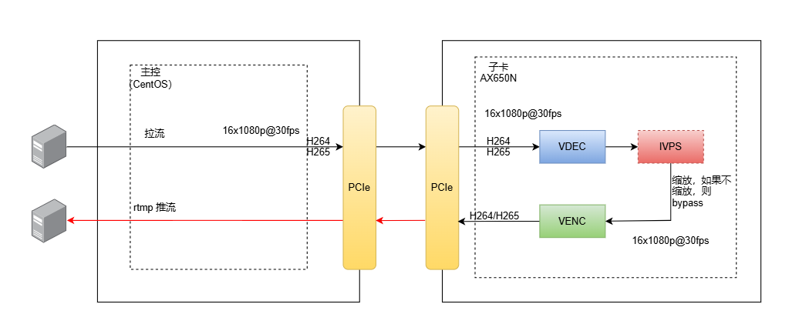

# AXCL Samples 说明

## AXCL Runtime API Samples

### axcl_sample_runtime

1. Initialize axcl runtime by axclrtInit.
2. Active EP by axclrtSetDevice.
3. Create context by axclrtCreateDevice for main thread. (optional)
4. Create and destory thread context. (must)
5. Destory context of main thread.
6. Deactive EP by axclrtResetDevice
7. Deinitialize runtime by axclFinalize

**usage**：

```bash
usage: ./axcl_sample_runtime [options] ...
options:
  -d, --device    device index from 0 to connected device num - 1 (unsigned int [=0])
      --json      axcl.json path (string [=./axcl.json])
  -?, --help      print this message
```

**example**：

```bash
$ ./axcl_sample_runtime -d 0
[INFO ][                            main][  22]: ============== V2.26.1 sample started Feb 13 2025 11:09:56 ==============
[INFO ][                            main][  34]: json: ./axcl.json
[INFO ][                            main][  53]: device index: 0, bus number: 129
[INFO ][                            main][  84]: ============== V2.26.1 sample exited Feb 13 2025 11:09:56 ==============
```

### axcl_sample_memory

sample for memcpy between host and device

        HOST                      DEVICE
    host_mem[0] ---------------> dev_mem[0] ----
                                               |
                                               |
    host_mem[1] <--------------- dev_mem[1] <---

1. alloc 2 host memories: *host_mem[2]*
2. alloc 2 device memories: *dev_mem[2]*
3. memcpy from host_mem[0] to dev_mem[0] by AXCL_MEMCPY_HOST_TO_DEVICE
4. memcpy from dev_mem[0] to dev_mem[1] by AXCL_MEMCPY_DEVICE_TO_DEVICE
5. memcpy from dev_mem[1] to host_mem[0] by AXCL_MEMCPY_DEVICE_TO_HOST
6. memcmp between host_mem[0] and host_mem[1]


**usage**：

```bash
usage: ./axcl_sample_memory [options] ...
options:
  -d, --device    device index from 0 to connected device num - 1 (int [=0])
      --json      axcl.json path (string [=./axcl.json])
  -?, --help      print this message
```

**example**：

```bash
$ ./axcl_sample_memory  -d 0
[INFO ][                            main][  32]: ============== V2.26.1 sample started Feb 13 2025 11:09:59 ==============
[INFO ][                           setup][ 112]: json: ./axcl.json
[INFO ][                           setup][ 131]: device index: 0, bus number: 129
[INFO ][                            main][  51]: alloc host and device memory, size: 0x800000
[INFO ][                            main][  63]: memory [0]: host 0xffff967fb010, device 0x14926f000
[INFO ][                            main][  63]: memory [1]: host 0xffff95ffa010, device 0x149a6f000
[INFO ][                            main][  69]: memcpy from host memory[0] 0xffff967fb010 to device memory[0] 0x14926f000
[INFO ][                            main][  75]: memcpy device memory[0] 0x14926f000 to device memory[1] 0x149a6f000
[INFO ][                            main][  81]: memcpy device memory[1] 0x149a6f000 to host memory[0] 0xffff95ffa010
[INFO ][                            main][  88]: compare host memory[0] 0xffff967fb010 and host memory[1] 0xffff95ffa010 success
[INFO ][                         cleanup][ 146]: deactive device 129 and cleanup axcl
[INFO ][                            main][ 106]: ============== V2.26.1 sample exited Feb 13 2025 11:09:59 ==============
```

## AXCL Native API Samples

### axcl_sample_sys

​	This module is the sample code of the SYS module provided by the SDK package, which is convenient for customers to quickly understand and master the use of SYS related interfaces.

​	The code demonstrates the following functions:

- Non-cache type CMM memory application and release
- Cache type CMM memory application and release
- Common pool creation and use
- User pool creation and use
- Binding relationship creation and query.

**usage:**

```bash
options:
  -d, --device    device index from 0 to connected device num - 1 (unsigned int [=0])
  -?, --help      print this message
```

**example:**

```bash
$ ./axcl_sample_sys -d 0
[INFO ][                            main][  35]: json: ./axcl.json
[INFO ][                            main][  55]: device index: 0, bus number: 129
[INFO ][           sample_sys_alloc_free][  82]: sys_alloc_free begin
[INFO ][           sample_sys_alloc_free][  91]: alloc PhyAddr= 0x14926f000,pVirAddr=0xffff82a3c000
[INFO ][           sample_sys_alloc_free][  91]: alloc PhyAddr= 0x14936f000,pVirAddr=0xffff8293c000
[INFO ][           sample_sys_alloc_free][  91]: alloc PhyAddr= 0x14946f000,pVirAddr=0xffff8283c000
[INFO ][           sample_sys_alloc_free][  91]: alloc PhyAddr= 0x14956f000,pVirAddr=0xffff8273c000
[INFO ][           sample_sys_alloc_free][  91]: alloc PhyAddr= 0x14966f000,pVirAddr=0xffff8263c000
[INFO ][           sample_sys_alloc_free][  91]: alloc PhyAddr= 0x14976f000,pVirAddr=0xffff8253c000
[INFO ][           sample_sys_alloc_free][  91]: alloc PhyAddr= 0x14986f000,pVirAddr=0xffff8243c000
[INFO ][           sample_sys_alloc_free][  91]: alloc PhyAddr= 0x14996f000,pVirAddr=0xffff8233c000
[INFO ][           sample_sys_alloc_free][  91]: alloc PhyAddr= 0x149a6f000,pVirAddr=0xffff8223c000
[INFO ][           sample_sys_alloc_free][  91]: alloc PhyAddr= 0x149b6f000,pVirAddr=0xffff8213c000
[INFO ][           sample_sys_alloc_free][ 100]: free PhyAddr= 0x14926f000,pVirAddr=0xffff82a3c000
[INFO ][           sample_sys_alloc_free][ 100]: free PhyAddr= 0x14936f000,pVirAddr=0xffff8293c000
[INFO ][           sample_sys_alloc_free][ 100]: free PhyAddr= 0x14946f000,pVirAddr=0xffff8283c000
[INFO ][           sample_sys_alloc_free][ 100]: free PhyAddr= 0x14956f000,pVirAddr=0xffff8273c000
[INFO ][           sample_sys_alloc_free][ 100]: free PhyAddr= 0x14966f000,pVirAddr=0xffff8263c000
[INFO ][           sample_sys_alloc_free][ 100]: free PhyAddr= 0x14976f000,pVirAddr=0xffff8253c000
[INFO ][           sample_sys_alloc_free][ 100]: free PhyAddr= 0x14986f000,pVirAddr=0xffff8243c000
[INFO ][           sample_sys_alloc_free][ 100]: free PhyAddr= 0x14996f000,pVirAddr=0xffff8233c000
[INFO ][           sample_sys_alloc_free][ 100]: free PhyAddr= 0x149a6f000,pVirAddr=0xffff8223c000
[INFO ][           sample_sys_alloc_free][ 100]: free PhyAddr= 0x149b6f000,pVirAddr=0xffff8213c000
[INFO ][           sample_sys_alloc_free][ 103]: sys_alloc_free end success
[INFO ][     sample_sys_alloc_cache_free][ 115]: sys_alloc_cache_free begin
[INFO ][     sample_sys_alloc_cache_free][ 124]: alloc PhyAddr= 0x14926f000,pVirAddr=0xffff82a3c000
[INFO ][     sample_sys_alloc_cache_free][ 124]: alloc PhyAddr= 0x14936f000,pVirAddr=0xffff8293c000
[INFO ][     sample_sys_alloc_cache_free][ 124]: alloc PhyAddr= 0x14946f000,pVirAddr=0xffff8283c000
[INFO ][     sample_sys_alloc_cache_free][ 124]: alloc PhyAddr= 0x14956f000,pVirAddr=0xffff8273c000
[INFO ][     sample_sys_alloc_cache_free][ 124]: alloc PhyAddr= 0x14966f000,pVirAddr=0xffff8263c000
[INFO ][     sample_sys_alloc_cache_free][ 124]: alloc PhyAddr= 0x14976f000,pVirAddr=0xffff8253c000
[INFO ][     sample_sys_alloc_cache_free][ 124]: alloc PhyAddr= 0x14986f000,pVirAddr=0xffff8243c000
[INFO ][     sample_sys_alloc_cache_free][ 124]: alloc PhyAddr= 0x14996f000,pVirAddr=0xffff8233c000
[INFO ][     sample_sys_alloc_cache_free][ 124]: alloc PhyAddr= 0x149a6f000,pVirAddr=0xffff8223c000
[INFO ][     sample_sys_alloc_cache_free][ 124]: alloc PhyAddr= 0x149b6f000,pVirAddr=0xffff8213c000
[INFO ][     sample_sys_alloc_cache_free][ 133]: free PhyAddr= 0x14926f000,pVirAddr=0xffff82a3c000
[INFO ][     sample_sys_alloc_cache_free][ 133]: free PhyAddr= 0x14936f000,pVirAddr=0xffff8293c000
[INFO ][     sample_sys_alloc_cache_free][ 133]: free PhyAddr= 0x14946f000,pVirAddr=0xffff8283c000
[INFO ][     sample_sys_alloc_cache_free][ 133]: free PhyAddr= 0x14956f000,pVirAddr=0xffff8273c000
[INFO ][     sample_sys_alloc_cache_free][ 133]: free PhyAddr= 0x14966f000,pVirAddr=0xffff8263c000
[INFO ][     sample_sys_alloc_cache_free][ 133]: free PhyAddr= 0x14976f000,pVirAddr=0xffff8253c000
[INFO ][     sample_sys_alloc_cache_free][ 133]: free PhyAddr= 0x14986f000,pVirAddr=0xffff8243c000
[INFO ][     sample_sys_alloc_cache_free][ 133]: free PhyAddr= 0x14996f000,pVirAddr=0xffff8233c000
[INFO ][     sample_sys_alloc_cache_free][ 133]: free PhyAddr= 0x149a6f000,pVirAddr=0xffff8223c000
[INFO ][     sample_sys_alloc_cache_free][ 133]: free PhyAddr= 0x149b6f000,pVirAddr=0xffff8213c000
[INFO ][     sample_sys_alloc_cache_free][ 136]: sys_alloc_cache_free end success
[INFO ][          sample_sys_commom_pool][ 148]: sys_commom_pool begin
[INFO ][          sample_sys_commom_pool][ 157]: AXCL_SYS_Init success!
[INFO ][          sample_sys_commom_pool][ 167]: AXCL_POOL_Exit success!
[INFO ][          sample_sys_commom_pool][ 199]: AXCL_POOL_SetConfig success!
[INFO ][          sample_sys_commom_pool][ 208]: AXCL_POOL_Init success!
[INFO ][          sample_sys_commom_pool][ 222]: AXCL_POOL_GetBlock success!BlkId:0x5E002000
[INFO ][          sample_sys_commom_pool][ 233]: AXCL_POOL_Handle2PoolId success!(Blockid:0x5E002000 --> PoolId=2)
[INFO ][          sample_sys_commom_pool][ 244]: AXCL_POOL_Handle2PhysAddr success!(Blockid:0x5E002000 --> PhyAddr=0x14ad8d000)
[INFO ][          sample_sys_commom_pool][ 255]: AXCL_POOL_Handle2MetaPhysAddr success!(Blockid:0x5E002000 --> MetaPhyAddr=0x14a18b000)
[INFO ][          sample_sys_commom_pool][ 265]: AXCL_POOL_ReleaseBlock success!Blockid=0x5e002000
[INFO ][          sample_sys_commom_pool][ 275]: AXCL_POOL_Exit success!
[INFO ][          sample_sys_commom_pool][ 285]: AXCL_SYS_Deinit success!
[INFO ][          sample_sys_commom_pool][ 288]: sys_commom_pool end success!
[INFO ][         sample_sys_private_pool][ 310]: sys_private_pool begin
[INFO ][         sample_sys_private_pool][ 319]: AXCL_SYS_Init success!
[INFO ][         sample_sys_private_pool][ 329]: AXCL_POOL_Exit success!
[INFO ][         sample_sys_private_pool][ 349]: AXCL_POOL_CreatePool[0] success
[INFO ][         sample_sys_private_pool][ 367]: AXCL_POOL_CreatePool[1] success
[INFO ][         sample_sys_private_pool][ 378]: AXCL_POOL_GetBlock success!BlkId:0x5E001000
[INFO ][         sample_sys_private_pool][ 389]: AXCL_POOL_Handle2PoolId success!(Blockid:0x5E001000 --> PoolId=1)
[INFO ][         sample_sys_private_pool][ 400]: AX_POOL_Handle2PhysAddr success!(Blockid:0x5E001000 --> PhyAddr=0x149879000)
[INFO ][         sample_sys_private_pool][ 411]: AXCL_POOL_Handle2MetaPhysAddr success!(Blockid:0x5E001000 --> MetaPhyAddr=0x149477000)
[INFO ][         sample_sys_private_pool][ 421]: AXCL_POOL_ReleaseBlock success!Blockid=0x5e001000
[INFO ][         sample_sys_private_pool][ 430]: AXCL_POOL_DestroyPool[1] success!
[INFO ][         sample_sys_private_pool][ 438]: AXCL_POOL_DestroyPool[0] success!
[INFO ][         sample_sys_private_pool][ 448]: AXCL_SYS_Deinit success!
[INFO ][         sample_sys_private_pool][ 451]: sys_private_pool end success!
[INFO ][                 sample_sys_link][ 472]: sample_sys_link begin
[INFO ][                 sample_sys_link][ 487]: AXCL_SYS_Init success!
[INFO ][                 sample_sys_link][ 554]: AXCL_SYS_Deinit success!
[INFO ][                 sample_sys_link][ 557]: sample_sys_link end success!
```


### axcl_sample_vdec

1. Load .mp4 or .h264/h265 stream file
2. Demux nalu by ffmpeg
3. Send nalu to VDEC by frame
4. Get decodec YUV


**usage**：

```bash
usage: ./axcl_sample_vdec --url=string [options] ...
options:
  -i, --url       mp4|.264|.265 file path (string)
  -d, --device    device index from 0 to connected device num - 1 (unsigned int [=0])
      --count     grp count (int [=1])
      --json      axcl.json path (string [=./axcl.json])
  -w, --width     frame width (int [=1920])
  -h, --height    frame height (int [=1080])
      --VdChn     channel id (int [=0])
      --yuv       transfer nv12 from device (int [=0])
  -?, --help      print this message

--count: how many streams are decoded at same time
-w: width of decoded output nv12 image
-h: height of decoded output nv12 image
--VdChn: VDEC output channel index
      0: PP0, same width and height for input stream, cannot support scaler down.
	  1: PP1, support scale down. range: [48x48, 4096x4096]
	  2: PP2, support scale down. range: [48x48, 1920x1080]
```

**example**：

decode 4 streams:

```bash
$ ./axcl_sample_vdec -i bangkok_30952_1920x1080_30fps_gop60_4Mbps.mp4 -d 0 --count 4
[INFO ][                            main][  43]: ============== V2.26.1 sample started Feb 13 2025 11:10:18 ==============

[INFO ][                            main][  67]: json: ./axcl.json
[INFO ][                            main][  87]: device index: 0, bus number: 129
[INFO ][             ffmpeg_init_demuxer][ 438]: [0] url: bangkok_30952_1920x1080_30fps_gop60_4Mbps.mp4
[INFO ][             ffmpeg_init_demuxer][ 501]: [0] url bangkok_30952_1920x1080_30fps_gop60_4Mbps.mp4: codec 96, 1920x1080, fps 30
[INFO ][             ffmpeg_init_demuxer][ 438]: [1] url: bangkok_30952_1920x1080_30fps_gop60_4Mbps.mp4
[INFO ][             ffmpeg_init_demuxer][ 501]: [1] url bangkok_30952_1920x1080_30fps_gop60_4Mbps.mp4: codec 96, 1920x1080, fps 30
[INFO ][             ffmpeg_init_demuxer][ 438]: [2] url: bangkok_30952_1920x1080_30fps_gop60_4Mbps.mp4
[INFO ][             ffmpeg_init_demuxer][ 501]: [2] url bangkok_30952_1920x1080_30fps_gop60_4Mbps.mp4: codec 96, 1920x1080, fps 30
[INFO ][             ffmpeg_init_demuxer][ 438]: [3] url: bangkok_30952_1920x1080_30fps_gop60_4Mbps.mp4
[INFO ][             ffmpeg_init_demuxer][ 501]: [3] url bangkok_30952_1920x1080_30fps_gop60_4Mbps.mp4: codec 96, 1920x1080, fps 30
[INFO ][                            main][ 115]: init sys
[INFO ][                            main][ 124]: init vdec
[INFO ][                            main][ 138]: start decoder 0
[INFO ][sample_get_vdec_attr_from_stream_info][ 251]: stream info: 1920x1080 payload 96 fps 30
[INFO ][                            main][ 175]: start demuxer 0
[INFO ][ sample_get_decoded_image_thread][ 310]: [decoder  0] decode thread +++
[INFO ][          ffmpeg_dispatch_thread][ 188]: [0] +++
[INFO ][             ffmpeg_demux_thread][ 294]: [0] +++
[INFO ][                            main][ 138]: start decoder 1
[INFO ][sample_get_vdec_attr_from_stream_info][ 251]: stream info: 1920x1080 payload 96 fps 30
[INFO ][                            main][ 175]: start demuxer 1
[INFO ][ sample_get_decoded_image_thread][ 310]: [decoder  1] decode thread +++
[INFO ][          ffmpeg_dispatch_thread][ 188]: [1] +++
[INFO ][                            main][ 138]: start decoder 2
[INFO ][sample_get_vdec_attr_from_stream_info][ 251]: stream info: 1920x1080 payload 96 fps 30
[INFO ][             ffmpeg_demux_thread][ 294]: [1] +++
[INFO ][                            main][ 175]: start demuxer 2
[INFO ][ sample_get_decoded_image_thread][ 310]: [decoder  2] decode thread +++
[INFO ][          ffmpeg_dispatch_thread][ 188]: [2] +++
[INFO ][             ffmpeg_demux_thread][ 294]: [2] +++
[INFO ][                            main][ 138]: start decoder 3
[INFO ][sample_get_vdec_attr_from_stream_info][ 251]: stream info: 1920x1080 payload 96 fps 30
[INFO ][ sample_get_decoded_image_thread][ 310]: [decoder  3] decode thread +++
[INFO ][                            main][ 175]: start demuxer 3
[INFO ][          ffmpeg_dispatch_thread][ 188]: [3] +++
[INFO ][             ffmpeg_demux_thread][ 294]: [3] +++
[INFO ][             ffmpeg_demux_thread][ 327]: [0] reach eof
[INFO ][             ffmpeg_demux_thread][ 434]: [0] demuxed    total 470 frames ---
[INFO ][             ffmpeg_demux_thread][ 327]: [1] reach eof
[INFO ][             ffmpeg_demux_thread][ 434]: [1] demuxed    total 470 frames ---
[INFO ][             ffmpeg_demux_thread][ 327]: [2] reach eof
[INFO ][             ffmpeg_demux_thread][ 434]: [2] demuxed    total 470 frames ---
[INFO ][             ffmpeg_demux_thread][ 327]: [3] reach eof
[INFO ][             ffmpeg_demux_thread][ 434]: [3] demuxed    total 470 frames ---
[INFO ][          ffmpeg_dispatch_thread][ 271]: [0] dispatched total 470 frames ---
[INFO ][          ffmpeg_dispatch_thread][ 271]: [1] dispatched total 470 frames ---
[INFO ][          ffmpeg_dispatch_thread][ 271]: [2] dispatched total 470 frames ---
[INFO ][          ffmpeg_dispatch_thread][ 271]: [3] dispatched total 470 frames ---
[WARN ][ sample_get_decoded_image_thread][ 356]: [decoder  2] flow end
[INFO ][ sample_get_decoded_image_thread][ 391]: [decoder  2] total decode 470 frames
[WARN ][ sample_get_decoded_image_thread][ 356]: [decoder  1] flow end
[INFO ][ sample_get_decoded_image_thread][ 391]: [decoder  1] total decode 470 frames
[WARN ][ sample_get_decoded_image_thread][ 356]: [decoder  0] flow end
[INFO ][ sample_get_decoded_image_thread][ 391]: [decoder  0] total decode 470 frames
[INFO ][                            main][ 196]: stop decoder 0
[INFO ][ sample_get_decoded_image_thread][ 397]: [decoder  2] dfecode thread ---
[INFO ][ sample_get_decoded_image_thread][ 397]: [decoder  1] dfecode thread ---
[INFO ][ sample_get_decoded_image_thread][ 397]: [decoder  0] dfecode thread ---
[INFO ][                            main][ 201]: decoder 0 is eof
[INFO ][                            main][ 196]: stop decoder 1
[INFO ][                            main][ 201]: decoder 1 is eof
[INFO ][                            main][ 196]: stop decoder 2
[WARN ][ sample_get_decoded_image_thread][ 356]: [decoder  3] flow end
[INFO ][ sample_get_decoded_image_thread][ 391]: [decoder  3] total decode 470 frames
[INFO ][ sample_get_decoded_image_thread][ 397]: [decoder  3] dfecode thread ---
[INFO ][                            main][ 201]: decoder 2 is eof
[INFO ][                            main][ 196]: stop decoder 3
[INFO ][                            main][ 201]: decoder 3 is eof
[INFO ][                            main][ 226]: stop demuxer 0
[INFO ][                            main][ 226]: stop demuxer 1
[INFO ][                            main][ 226]: stop demuxer 2
[INFO ][                            main][ 226]: stop demuxer 3
[INFO ][                            main][ 234]: deinit vdec
[INFO ][                            main][ 238]: deinit sys
[INFO ][                            main][ 242]: axcl deinit
[INFO ][                            main][ 246]: ============== V2.26.1 sample exited Feb 13 2025 11:10:18 ==============
```


### axcl_sample_venc

​	This module is part of the SDK package and provides sample code for the video encoding unit (H.264, H.265, JPEG, MJPEG). It aims to help customers quickly understand and master the usage of video encoding-related interfaces. The code demonstrates the following processes: initialization of the video encoding module, sending frame data via an encoding Send thread, obtaining and saving encoded stream data via an encoding Get thread, and deinitialization of the video encoding module.

   After compilation, the executable `axcl_sample_venc` is located in the `/usr/bin/axcl` directory and can be used to verify video encoding functionality.

   - **-w**: Configure the source data width.
   - **-h**: Configure the source data height.
   - **-i**: Path to the input source data.
   - **-l**: Input source data YUV format (1: I420; 3: NV12; 4: NV21; 13: YUYV422; 14: UYVY422). Default is 1.
   - **-N**: Configure the number of encoding channels. By default, it enables four channels for encoding H.264, H.265, MJPEG, and JPEG.
   - **-n**: When loop encoding is enabled, specify the number of frames to encode.
   - **-W**: Whether to write the encoded stream to a file (default is 1, which means writing to a file. 0: do not write).

:::{Note}

  - Some parameters in the example code may not be optimal and are only intended for API demonstration. In actual development, users need to configure parameters according to specific business scenarios.
  - H.264/H.265 support a maximum resolution of 8192x8192.
  - JPEG/MJPEG support a maximum resolution of 16384x16384.

:::

**example:**

​	Upon successful execution, press `Ctrl+C` to exit. Stream files should be generated in the current directory with extensions like .264, .265, .jpg, or .mjpg. Users can open these files to view the actual results.

1. View help information
   ```bash
   axcl_sample_venc -H
   ```

2. Enable two channels to encode 1080p NV12 format (Channel 0: H.264, Channel 1: H.265)
   ```bash
   axcl_sample_venc -w 1920 -h 1080 -i 1080p_nv12.yuv -N 2 -l 3
   ```

3. Enable two channels to loop encode 3840x2160 NV21 format (Channel 0: H.264, Channel 1: H.265), encoding 10 frames
   ```bash
   axcl_sample_venc -w 3840 -h 2160 -i 3840x2160_nv21.yuv -N 2 -l 4 -n 10
   ```

4. Encode one MJPEG stream with resolution 1920x1080, YUV420P format, encoding 5 frames
   ```bash
   axcl_sample_venc -w 1920 -h 1080 -i 1920x1080_yuv420p.yuv -N 1 --bChnCustom 1 --codecType 2 -l 1 -n 5
   ```


### axcl_sample_transcode

 

1. Load .mp4 or .h264/h265 stream file
2. Demux nalu by ffmpeg
3. Send nalu frame to VDEC
4. VDEC send decoded nv12 to IVPS (if resize)
5. IVPS send nv12 to VENC
6. Send encoded nalu frame by VENC to host.


**modules deployment**：

```bash
|-----------------------------|
|          sample             |
|-----------------------------|
|      libaxcl_ppl.so         |
|-----------------------------|
|      libaxcl_lite.so        |
|-----------------------------|
|         axcl sdk            |
|-----------------------------|
|         pcie driver         |
|-----------------------------|
```

**transcode ppl attributes**：

```bash
        attribute name                       R/W    attribute value type
 *  axcl.ppl.transcode.vdec.grp             [R  ]       int32_t                            allocated by ax_vdec.ko
 *  axcl.ppl.transcode.ivps.grp             [R  ]       int32_t                            allocated by ax_ivps.ko
 *  axcl.ppl.transcode.venc.chn             [R  ]       int32_t                            allocated by ax_venc.ko
 *
 *  the following attributes take effect BEFORE the axcl_ppl_create function is called:
 *  axcl.ppl.transcode.vdec.blk.cnt         [R/W]       uint32_t          8                depend on stream DPB size and decode mode
 *  axcl.ppl.transcode.vdec.out.depth       [R/W]       uint32_t          4                out fifo depth
 *  axcl.ppl.transcode.ivps.in.depth        [R/W]       uint32_t          4                in fifo depth
 *  axcl.ppl.transcode.ivps.out.depth       [R  ]       uint32_t          0                out fifo depth
 *  axcl.ppl.transcode.ivps.blk.cnt         [R/W]       uint32_t          4
 *  axcl.ppl.transcode.ivps.engine          [R/W]       uint32_t   AX_IVPS_ENGINE_VPP      AX_IVPS_ENGINE_VPP|AX_IVPS_ENGINE_VGP|AX_IVPS_ENGINE_TDP
 *  axcl.ppl.transcode.venc.in.depth        [R/W]       uint32_t          4                in fifo depth
 *  axcl.ppl.transcode.venc.out.depth       [R/W]       uint32_t          4                out fifo depth

NOTE:
 The value of "axcl.ppl.transcode.vdec.blk.cnt" depends on input stream.
 Usually set to dpb + 1
```

**usage**：

```bash
usage: ./axcl_sample_transcode --url=string [options] ...
options:
  -i, --url       mp4|.264|.265 file path (string)
  -d, --device    device index from 0 to connected device num - 1 (unsigned int [=0])
  -w, --width     output width, 0 means same as input (unsigned int [=0])
  -h, --height    output height, 0 means same as input (unsigned int [=0])
      --codec     encoded codec: [h264 | h265] (default: h265) (string [=h265])
      --json      axcl.json path (string [=./axcl.json])
      --loop      1: loop demux for local file  0: no loop(default) (int [=0])
      --dump      dump file path (string [=])
      --hwclk     decoder hw clk, 0: 624M, 1: 500M, 2: 400M(default) (unsigned int [=2])
      --ut        unittest
  -?, --help      print this message
```

>
> ./axcl_sample_transcode: error while loading shared libraries: libavcodec.so.58: cannot open shared object file: No such file or directory
> if above error happens, please configure ffmpeg libraries into LD_LIBRARY_PATH.
> As for x86_x64 OS:  *export LD_LIBRARY_PATH=$LD_LIBRARY_PATH:/usr/lib/axcl/ffmpeg*
>

**example**：

```bash
# transcode input 1080P@30fps 264 to 1080P@30fps 265, save into /tmp/axcl/transcode.dump.pidxxx file.
$ ./axcl_sample_transcode -i bangkok_30952_1920x1080_30fps_gop60_4Mbps.mp4 -d 0 --dump /tmp/axcl/transcode.265
[INFO ][                            main][  66]: ============== V2.26.1 sample started Feb 13 2025 16:37:03 pid 798 ==============
[WARN ][                            main][  91]: if enable dump, disable loop automatically
[INFO ][                            main][ 130]: pid: 798, device index: 0, bus number: 129
[INFO ][             ffmpeg_init_demuxer][ 438]: [798] url: bangkok_30952_1920x1080_30fps_gop60_4Mbps.mp4
[INFO ][             ffmpeg_init_demuxer][ 501]: [798] url bangkok_30952_1920x1080_30fps_gop60_4Mbps.mp4: codec 96, 1920x1080, fps 30
[INFO ][         ffmpeg_set_demuxer_attr][ 570]: [798] set ffmpeg.demux.file.frc to 1
[INFO ][         ffmpeg_set_demuxer_attr][ 573]: [798] set ffmpeg.demux.file.loop to 0
[INFO ][                            main][ 194]: pid 798: [vdec 00] - [ivps -1] - [venc 00]
[INFO ][                            main][ 212]: pid 798: VDEC attr ==> blk cnt: 8, fifo depth: out 4
[INFO ][                            main][ 213]: pid 798: IVPS attr ==> blk cnt: 5, fifo depth: in 4, out 0, engine 1
[INFO ][                            main][ 215]: pid 798: VENC attr ==> fifo depth: in 4, out 4
[INFO ][          ffmpeg_dispatch_thread][ 188]: [798] +++
[INFO ][             ffmpeg_demux_thread][ 294]: [798] +++
[INFO ][             ffmpeg_demux_thread][ 327]: [798] reach eof
[INFO ][             ffmpeg_demux_thread][ 434]: [798] demuxed    total 470 frames ---
[INFO ][          ffmpeg_dispatch_thread][ 271]: [798] dispatched total 470 frames ---
[INFO ][                            main][ 246]: ffmpeg (pid 798) demux eof
[INFO ][                            main][ 282]: total transcoded frames: 470
[INFO ][                            main][ 283]: ============== V2.26.1 sample exited Feb 13 2025 16:37:03 pid 798 ==============
```

**launch_transcode.sh**：

**launch_transcode.sh** supports to launch multi.(max. 16) axcl_sample_transcode and configure LD_LIBRARY_PATH automatically.

```bash
Usage:
./launch_transcode.sh 16 -i bangkok_30952_1920x1080_30fps_gop60_4Mbps.mp4  -d 3 --dump /tmp/axcl/transcode.265
```

>The 1st argument must be the number of *axcl_sample_transcode* processes. range: [1, 16]


### axcl_sample_dmadim

1. memcpy between two device memories by `AXCL_DMA_MemCopy`
2. memset device memory to `0xAB` by `AXCL_DMA_MemCopy`
3. checksum by `AXCL_DMA_CheckSum`
4. crop 1/4 image from (0, 0) by `AXCL_DMA_MemCopyXD` (`AX_DMADIM_2D`)

**usage**：

```bash
usage: ./axcl_sample_dmadim --image=string --width=unsigned int --height=unsigned int [options] ...
options:
  -d, --device    device index from 0 to connected device num - 1 (unsigned int [=0])
  -i, --image     nv12 image file path (string)
  -w, --width     width of nv12 image (unsigned int)
  -h, --height    height of nv12 image (unsigned int)
      --json      axcl.json path (string [=./axcl.json])
  -?, --help      print this message
```

**example**：

```bash
$ ./axcl_sample_dmadim -i 1920x1080.nv12.yuv -w 1920 -h 1080 -d 0
[INFO ][                            main][  30]: ============== V2.26.1 sample started Feb 13 2025 11:10:23 ==============
[INFO ][                            main][  46]: json: ./axcl.json
[INFO ][                            main][  66]: device index: 0, bus number: 129
[INFO ][                        dma_copy][ 119]: dma copy device memory succeed, from 0x14926f000 to 0x14966f000
[INFO ][                      dma_memset][ 139]: dma memset device memory succeed, 0x14926f000 to 0xab
[INFO ][                    dma_checksum][ 166]: dma checksum succeed, checksum = 0xaaa00000
[INFO ][                      dma_copy2d][ 281]: [0] dma memcpy 2D succeed
[INFO ][                      dma_copy2d][ 281]: [1] dma memcpy 2D succeed
[INFO ][                      dma_copy2d][ 308]: ./dma2d_output_image_960x540.nv12 is saved
[INFO ][                      dma_copy2d][ 328]: dma copy2d nv12 image pass
[INFO ][                            main][  82]: ============== V2.26.1 sample exited Feb 13 2025 11:10:23 ==============
```


### axcl_sample_ive

The sample code here is for the IVE (Intelligent Video Analysis Engine) module provided whithin the Aixin SDK package, which facilitates customers to quickly understand and rightly use these IVE related interfaces.

`axcl_sample_ive` is generated with this smaple code and located at the directory of `usr/bin/axcl/`，which is showing how to use it.

**usage:**

```bash
Usage : ./axcl_sample_ive -c case_index [options]
        -d | --device_id: Device index from 0 to connected device num - 1, optional
        -c | --case_index:Calc case index, default:0
                0-DMA.
                1-DualPicCalc.
                2-HysEdge and CannyEdge.
                3-CCL.
                4-Erode and Dilate.
                5-Filter.
                6-Hist and EqualizeHist.
                7-Integ.
                8-MagAng.
                9-Sobel.
                10-GMM and GMM2.
                11-Thresh.
                12-16bit to 8bit.
                13-Multi Calc.
                14-Crop and Resize.
                15-CSC.
                16-CropResize2.
                17-MatMul.
        -e | --engine_choice:Choose engine id, default:0
                0-IVE; 1-TDP; 2-VGP; 3-VPP; 4-GDC; 5-DSP; 6-NPU; 7-CPU; 8-MAU.
                For Crop and Resize case, cropimage support IVE/VGP/VPP engine, cropresize and cropresize_split_yuv support VGP/VPP engine.
                For CSC case, support TDP/VGP/VPP engine.
                For CropResize2 case, support VGP/VPP engine.
                For MatMul case, support NPU/MAU engine.
        -m | --mode_choice:Choose test mode, default:0
                For DualPicCalc case, indicate dual pictures calculation task:
                  0-add; 1-sub; 2-and; 3-or; 4-xor; 5-mse.
                For HysEdge and CannyEdge case, indicate hys edge or canny edge calculation task:
                  0-hys edge; 1-canny edge.
                For Erode and Dilate case, indicate erode or dilate calculation task:
                  0-erode; 1-dilate.
                For Hist and EqualizeHist case, indicate hist or equalize hist calculation task:
                  0-hist; 1-equalize hist.
                For GMM and GMM2 case, indicate gmm or gmm2 calculation task:
                  0-gmm; 1-gmm2.
                For Crop and Resize case, indicate cropimage, cropresize, cropresize_split_yuv calculation task:
                  0-crop image; 1-crop_resize; 2-cropresize_split_yuv.
                For CropResize2 case, indicate crop_resize2 or cropresize2_split_yuv calculation task:
                  0-crop_resize2; 1-cropresize2_split_yuv.
        -t | --type_image:Image type index refer to IVE_IMAGE_TYPE_E(IVE engine) or AX_IMG_FORMAT_E(other engine)
                Note:
                  1. For all case, both input and output image types need to be specified in the same order as the specified input and output file order.
                  2. If no type is specified, i.e. a type value of -1 is passed in, then a legal type is specified, as qualified by the API documentation.
                  3. Multiple input and output image types, separated by spaces.
                  4. For One-dimensional data (such as AX_IVE_MEM_INFO_T type data), do not require a type to be specified.
        -i | --input_files:Input image files, if there are multiple inputs, separated by spaces.
        -o | --output_files:Output image files or dir, if there are multiple outputs, separated by spaces
                Note:for DMA, Crop Resize, blob of CCL case and CropResize2 case must be specified as directory.
        -w | --width:Image width of inputs, default:1280.
        -h | --height:Image height of inputs, default:720.
        -p | --param_list:Control parameters list or file(in json data format)
                Note:
                  1. Please refer to the json file in the '/opt/data/ive/' corresponding directory of each test case.
                  2. For MagAng, Multi Calc and CSC case, no need control parameters.
        -a | --align_need:Does the width/height/stride need to be aligned automatically, default:0.
                  0-no; 1-yes.
        -? | --help:Show usage help.
```

**example:**

:::{Note}

   - Sample code is only for API demo, but in fact specific configrature parameter is needed according to user context.
  - Please refer to document named `42 - AX IVE API` for paramter limition.
  - Memory filled with input and output data must be alloced by user.
  - Image data of input and output must be specified by user.
  - The number of input images (or data) from different CV may not be similar.
  - The data type of 2-D images must be defined clearly ,or as default value.
  - These Key parameter is formated as Json string or Json file. Please refer to .json file and code in some directories of /opt/data/ive/.

:::

1. show help text

   ```bash
   ./axcl_sample_ive -?
   ```

2. DMA usage (source resolution: 1280 x 720, input/output type : U8C1, Json file used to config control paramter)

   ```bash
   ./axcl_sample_ive -c 0 -w 1280 -h 720 -i /opt/data/ive/common/1280x720_u8c1_gray.yuv -o /opt/data/ive/dma/ -t 0 0 -p /opt/data/ive/dma/dma.json
   ```

3. MagAndAng usage (source resolution: 1280 x 720, input parameter(grad_h, grad_v)'s data type: U16C1, output parameter (ang_output)'s data type : U8C1)

   ```bash
   ./axcl_sample_ive -c 8 -w 1280 -h 720 -i /opt/data/ive/common/1280x720_u16c1_gray.yuv /opt/data/ive/common/1280x720_u16c1_gray_2.yuv -o /opt/data/ive/common/mag_output.bin /opt/data/ive/common/ang_output.bin -t 9 9 9 0
   ```

**json file parameters:**

1. **dma.json**
   - `mode`, `x0`, `y0`, `h_seg`, `v_seg`, `elem_size` and `set_val` are the value of respective member in structure `AX_IVE_DMA_CTRL_T` such as `enMode`, `u16CrpX0`, `u16CrpY0`, `u8HorSegSize`, `u8VerSegRows`, `u8ElemSize`, `u64Val`.
   - `w_out` and `h_out` is respectivly the width and height of output image, only for `AX_IVE_DMA_MODE_DIRECT_COPY` mode in DMA.
2. **dualpics.json**
   - `x` and `y` are the value of `u1q7X` and `u1q7Y` in structure `AX_IVE_ADD_CTRL_T` for ADD CV.
   - `mode` is the value of `enMode` in structure `AX_IVE_SUB_CTRL_T` for Sub CV.
   - `mse_coef` is the value of `u1q15MseCoef` in structure `AX_IVE_MSE_CTRL_T` for MSE CV.
3. **ccl.json**
   - `mode` is the value of `enMode` of structure `AX_IVE_CCL_CTRL_T` for CCL CV.
4. **ed.json**
   - `mask` is all values of `au8Mask[25]` in structure `AX_IVE_ERODE_CTRL_T` for Erode CV or `AX_IVE_DILATE_CTRL_T` for Dilate CV.
5. **filter.json**
   - `mask` is all values of `as6q10Mask[25]` in structure `AX_IVE_FILTER_CTRL_T` for Filter CV.
6. **hist.json**
   - `histeq_coef` is the value of `u0q20HistEqualCoef` in structure `AX_IVE_EQUALIZE_HIST_CTRL_T` for EqualizeHist CV.
7. **integ.json**
   - `out_ctl` is the value of `enOutCtrl` in structure `AX_IVE_INTEG_CTRL_T` for Integ CV.
8. **sobel.json**
   - `mask` is the value of `as6q10Mask[25]` in structure `AX_IVE_SOBEL_CTRL_T` for Sobel CV.
9. **gmm.json**
   - `init_var`, `min_var`, `init_w`, `lr`, `bg_r`, `var_thr` and `thr` are respectivly the value of `u14q4InitVar`, `u14q4MinVar`, `u1q10InitWeight`, `u1q7LearnRate`, `u1q7BgRatio`, `u4q4VarThr` and `u8Thr` in structure `AX_IVE_GMM_CTRL_T` for GMM CV.
10. **gmm2.json:**
    - `init_var`, `min_var`, `max_var`, `lr`, `bg_r`, `var_thr`, `var_thr_chk`, `ct` and `thr` are respectivly the value of `u14q4InitVar`, `u14q4MinVar`, `u14q4MaxVar`, `u1q7LearnRate`, `u1q7BgRatio`, `u4q4VarThr`, `u4q4VarThrCheck`, `s1q7CT` and `u8Thr` in structure `AX_IVE_GMM2_CTRL_T` for GMM2 CV.
11. **thresh.json**
    - `mode`, `thr_l`, `thr_h`, `min_val`, `mid_val` and `max_val` are repectivly the value of `enMode`, `u8LowThr`, `u8HighThr`, `u8MinVal`, `u8MidVal` and `u8MaxVal` in structure `AX_IVE_THRESH_CTRL_T` for Thresh CV.
12. **16bit_8bit.json**
    - `mode`, `gain` and `bias` are repectivly the value of `enMode`, `s1q14Gain` and `s16Bias` in structure `AX_IVE_16BIT_TO_8BIT_CTRL_T` for 16BitTo8Bit CV.
13. **crop_resize.json**
    - When CropImage is enabled, num is the value of `u16Num` in structure `AX_IVE_CROP_IMAGE_CTRL_T` and boxs is the array type of crop image in which `x`,`y`,`w` and `h` are respecivly the value of `u16X`, `u16Y`, `u16Width` and `u16Height` in structure `AX_IVE_RECT_U16_T`.
    - When CropResize or CropResizeForSplitYUV mode is enabled, `num` is the value of `u16Num` in structure `AX_IVE_CROP_RESIZE_CTRL_T` and `align0`, `align1`, `enAlign[1]`, `bcolor`, `w_out` and `h_out` are respectivly the value of `enAlign[0]`, `enAlign[1]`, `u32BorderColor`, `width` and `height` of output image.
14. **crop_resize2.json**
    - `num` is the value of `u16Num` in structure `AX_IVE_CROP_IMAGE_CTRL_T`.
    - `res_out` is the arrayes of width and height of output image.
    - **`src_boxs` is the array of cropped range from source image, `dst_boxs` is the array of range to resized image.**
15. **matmul.json**
    - `mau_i`, `ddr_rdw`, `en_mul_res`, `en_topn_res`, `order` and `topn` are respectivly the value of `enMauId`, `s32DdrReadBandwidthLimit`, `bEnableMulRes`, `bEnableTopNRes`, `enOrder` and `s32TopN` in structure `AX_IVE_MAU_MATMUL_CTRL_T`.
    - `type_in` is the value of `stMatQ` and `stMatB` in structure `AX_IVE_MAU_MATMUL_INPUT_T`.
    - `type_mul_res` and `type_topn_res` are the value of `stMulRes` and `sfTopNRes` in structure `AX_IVE_MAU_MATMUL_OUTPUT_T`.
    - `q_shape` and `b_shape` are the value of `pShape` in `stMatQ` and `stMatB` of structure `AX_IVE_MAU_MATMUL_INPUT_T`


### axcl_sample_ivps

​	The IVPS(Image Video Process System) unit provided in the Axera SDK package is a video image processing subsystem that provides functions such as cropping, scaling, rotation, streaming, CSC, OSD, mosaic, quadrilateral, etc.

  	This module is an example code of IVPS unit, which is convenient for users to quickly understand and master the use of IVPS related interfaces.

  	`axcl_sample_ivps` bin is located in the directory of `/usr/bin/axcl/`, and can be used for IVPS interface examples.

**usage:**

```bash
Usage: axcl_sample_ivps
        -d             (required) : device index from 0 to connected device num - 1
        -v             (required) : video frame input
        -g             (optional) : overlay input
        -s             (optional) : sp alpha input
        -n             (optional) : repeat number
        -r             (optional) : region config and update
        -l             (optional) : 0: no link 1. link ivps. 2: link venc. 3: link jenc
        --pipeline     (optional) : import ini file to config all the filters in one pipeline
        --pipeline_ext (optional) : import ini file to config all the filters in another pipeline
        --change       (optional) : import ini file to change parameters for one filter dynamicly
        --region       (optional) : import ini file to config region parameters
        --dewarp       (optional) : import ini file to config dewarp parameters, including LDC, perspective, fisheye, etc.
        --cmmcopy      (optional) : cmm copy API test
        --csc          (optional) : color space covert API test
        --fliprotation (optional) : flip and rotation API test
        --alphablend   (optional) : alpha blending API test
        --cropresize   (optional) : crop resize API test
        --osd          (optional) : draw osd API test
        --cover        (optional) : draw line/polygon API test
        -a             (optional) : all the sync API test

        --json         (optional) : axcl.json path

            -v  <PicPath>@<Format>@<Stride>x<Height>@<CropW>x<CropH>[+<CropX0>+<CropY0>]>
           e.g: -v /opt/bin/data/ivps/800x480car.nv12@3@800x480@600x400+100+50

           [-g] <PicPath>@<Format>@<Stride>x<Height>[+<DstX0>+<DstY0>*<Alpha>]>
           e.g: -g /opt/bin/data/ivps/rgb400x240.rgb24@161@400x240+100+50*150

           [-n] <repeat num>]
           [-r] <region num>]

        <PicPath>                     : source picture path
        <Format>                      : picture color format
                   3: NV12     YYYY... UVUVUV...
                   4: NV21     YYYY... VUVUVU...
                  10: NV16     YYYY... UVUVUV...
                  11: NV61     YYYY... VUVUVU...
                 161: RGB888   24bpp
                 165: BGR888   24bpp
                 160: RGB565   16bpp
                 197: ARGB4444 16bpp
                 203: RGBA4444 16bpp
                 199: ARGB8888 32bpp
                 201: RGBA8888 32bpp
                 198: ARGB1555 16bpp
                 202: RGBA5551 16bpp
                 200: ARGB8565 24bpp
                 204: RGBA5658 24bpp
                 205: ABGR4444 16bpp
                 211: BGRA4444 16bpp
                 207: ABGR8888 32bpp
                 209: BGRA8888 32bpp
                 206: ABGR1555 16bpp
                 210: BGRA5551 16bpp
                 208: ABGR8565 24bpp
                 212: BGRA5658 24bpp
                 224: BITMAP    1bpp
        <Stride>           (required) : picture stride (16 bytes aligned)
        <Stride>x<Height>  (required) : input frame stride and height (2 aligned)
        <CropW>x<CropH>    (required) : crop rect width & height (2 aligned)
        +<CropX0>+<CropY0> (optional) : crop rect coordinates
        +<DstX0>+<DstY0>   (optional) : output position coordinates
        <Alpha>            (optional) : ( (0, 255], 0: transparent; 255: opaque)

Example1:
        axcl_sample_ivps -d 0 -v /opt/data/ivps/1920x1088.nv12@3@1920x1088@1920x1088  -n 1
```


:::{Note}

- ***\*-v\**** is a required item, with the input source image path and frame information.
  The cropping window should be within the height range of the source image, that is CropX0 + CropW <= Stride, CropY0 + CropH <= Height.
  If cropping is not performed, then CropW = Width, CropH = Height, CropX0 = 0, and CropY0 = 0.

- ***\*-n\**** indicates that the source image is processed for a specified number of times. If the parameter is -1, it will be executed in a loop all the time.
  If you want to view the proc information of the IVPS, you need to set the number of processing times to a large value or cycle all the time.

- The input parameter after ***\*-r\**** is the number of overlayed REGIONs, currently the maximum is 4.
  The overlay of REGIONs on IVPS PIPELINE is an asynchronous operation, which requires several frames before it is really overlayed on the input source image.
  Therefore, if you want to verify the REGION function, you need to set the parameter after -n to be larger, the value should be greater than 3.2.

:::

**example:**

1. View help information

   ```bash
   axcl_sample_ivps -h
   ```

2. Process source image (3840x2160 NV12 format) once

   ```bash
   axcl_sample_ivps -v /opt/data/ivps/3840x2160.nv12@3@3840x2160@0x0+0+0 -d 0 -n 1
   ```

3. Process source image (800x480 RGB 888 format) with cropping(X0=128 Y0=50 W=400 H=200) for three times

   ```bash
   axcl_sample_ivps -v /opt/data/ivps/800x480logo.rgb24@161@800x480@400x200+128+50 -d 0 -n 3
   ```

4. Process the source image (3840x2160 NV12 format) for five times, with overlaying three REGIONs

   ```bash
   axcl_sample_ivps -v /opt/data/ivps/3840x2160.nv12@3@3840x2160@0x0+0+0 -d 0 -n 5 -r 3
   ```

After running successfully, the following images will be generated in the same directory as the source image (`/opt/data/ivps`)， which can be opened and viewed through a tool.

- FlipMirrorRotate_chn0_480x800.fmt_a1
- OSD_chn0_3840x2160.fmt_3
- AlphaBlend_chn0_3840x2160.fmt_3
- Rotate_chn0_1088x1920.fmt_3
- CSC_chn0_3840x2160.fmt_3
- CropResize_chn0_1280x720.fmt_3
- PIPELINEoutput_grp1chn0_1920x1080.fmt_3
- PIPELINEoutput_grp1chn1_2688x1520.fmt_a1
- PIPELINEoutput_grp1chn2_768x1280.fmt_a1

:::{Note}

- fmt_3：Represents NV12 format; fmt_a1：Represents RGB 888 format (a1 indicates hexadecimal 0xa1)
- Execute Ctrl + C to exit.
- The sample code is only used for API demonstration. In actual development, users need to configure parameters in combination with specific business scenarios.
- The maximum resolution of input image and output image is 8192x8192.

:::

