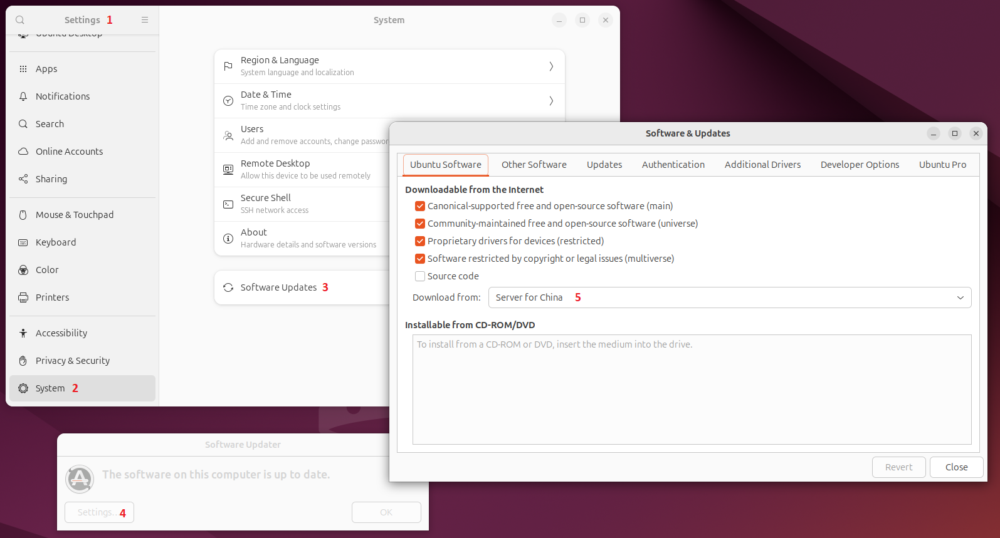
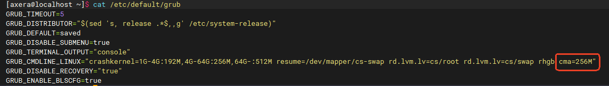
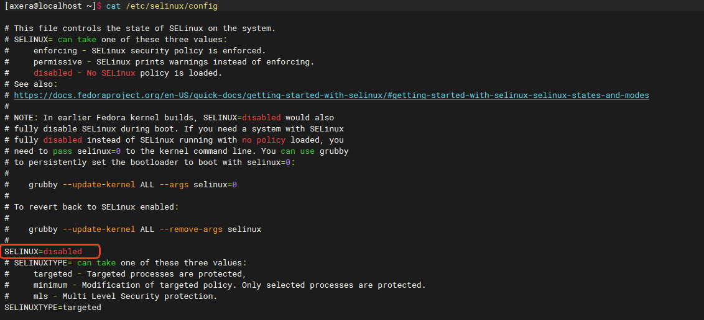
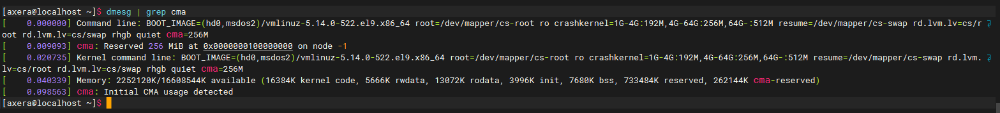

# AXCL 安装

## Raspberry Pi 5

### 准备工作

在树莓派 5 上安装 AX650 加速卡时，首先需要准备一块 M.2 HAT+ 扩展板。参考[官方链接](https://www.raspberrypi.com/news/using-m-2-hat-with-raspberry-pi-5/)，M.2 HAT+ 的官方版本只支持 2230、2242 的 M.2 M Key 卡，通常 AX650 加速卡是 2280 的，您可能需要考虑购买第三方的支持 2280 长度的 M.2 HAT+ 扩展板。

:::{Warning}
根据树莓派硬件批次不同，可能需要更新一下树莓派的 EEPROM 设置。具体步骤如下：
:::

如同 PC 中的 BIOS，EEPROM 设置独立于烧录 OS 的 TF 卡，烧录最新的树莓派镜像或者切换镜像版本并不会主动更新 EEPROM 的设置。首先执行 update：

```bash
sudo apt update && sudo apt full-upgrade
```

然后检查一下 EEPROM 中的版本：

```bash
sudo rpi-eeprom-update
```

如果看到的日期早于 `2023 年 12 月 6 日`，运行以下命令以打开 Raspberry Pi 配置 CLI：

```bash
sudo raspi-config
```

在 Advanced Options > Bootloader Version （引导加载程序版本） 下，选择 Latest （最新）。然后，使用 Finish 或 ESC 键退出 raspi-config。

执行以下命令，将固件更新到最新版本。

```bash
sudo rpi-eeprom-update -a
```

最后使用 `sudo reboot` 重新启动。重启后就完成了 EEPROM 中 firmware 的更新。


:::{Warning}
取决于使用的树莓派 kernel 状态，目前的修改是以 2024年11月18日 以前的树莓派刚烧录好的系统为例进行说明的，客户需要根据树莓派系统更新情况识别这个步骤是否必须。
:::

在当前的树莓派 kernel 和 M.2 HAT+ 组合中，可能会遇到如下限制：

> - PCIE Device 无法识别
> - PCIE MSI IRQ 无法申请多个

这些问题将导致安装失败或者子卡起不来。需要检查 Raspberry Pi 5 `/boot/firmware/config.txt` 文件，并进行修改。

如果是第三方的兼容 M.2 HAT+ 产品，需要注意供电问题；在 config.txt 中添加如下描述：

```bash
dtparam=pciex1
```
该描述可以默认打开 PCIE 功能；然后继续增加 PCIE 的设备描述：

```bash
[all]
dtoverlay=pciex1-compat-pi5,no-mip
```

完成修改并重启后，可以使用 `lspci` 命令检查加速卡是否正确被识别：

```bash
axera@raspberrypi:~ $ lspci
0000:00:00.0 PCI bridge: Broadcom Inc. and subsidiaries BCM2712 PCIe Bridge (rev 21)
0000:01:00.0 Multimedia video controller: Axera Semiconductor Co., Ltd Device 0650 (rev 01)
0001:00:00.0 PCI bridge: Broadcom Inc. and subsidiaries BCM2712 PCIe Bridge (rev 21)
0001:01:00.0 Ethernet controller: Raspberry Pi Ltd RP1 PCIe 2.0 South Bridge
```

其中 `Multimedia video controller: Axera Semiconductor Co., Ltd Device 0650 (rev 01)` 就是 AX650 加速卡。

### 生成或获取安装包

可以从随 AX650 SDK 发布的发布包中获取已经随版本编译好的 `axcl_host_aarch64_V2.XX.X_202XXX.deb`，或使用 SDK 自行编译，其中编译生成的产物 `.deb` 的脚本可以根据需要自行修改定制。此外，树莓派可用的 OS 种类众多，这里主要以 `debian` 系列依赖 `.deb` 安装包的系统为例。

SDK 编译的命令参考如下：

```bash
cd axcl/build
make host=arm64 clean all install -j32
cd build
make p=AX650_card clean all install axp -j128
```

编译完成后，arm64 deb 包生成在 build/out 下。

### 安装安装包

:::{Warning}
开发板需要编译支持，依赖 gcc, make, patch, linux-header-$(uname -r) 这几个包。需要提前安装好，或者保证安装时网络可用。
:::

将 aarch64 deb 包复制到树莓派开发板上，运行安装命令：

```bash
sudo dpkg -i axcl_host_aarch64_V2.16.1_20241118020146_NO4446.deb
```

安装将很快完成。安装时会自动增加环境变量，使得安装的 .so 和可执行程序可用。需要注意的是，如果需要可执行程序立即可用，还需要更新 bash 终端的环境：

```bash
source /etc/profile
```

如果是 ssh 的方式远程连接的板卡，还可以选择重连 ssh 进行自动更新(本机终端登录还可以重开一个终端进行自动更新)。

### 启动子卡

> - deb 包安装完成后将会自动启动子卡，无需再执行 `axclboot` 启动子卡
> - 主机启动时，将会自动启动子卡

### 卸载安装

```bash
sudo dpkg -r axclhost
```

:::{Warning}
卸载的包名不是安装包的名字，是项目包名，即 axclhost。
:::

deb 包卸载时，会自动 reset 子卡，子卡进入pcie download mode。

## RK3588 等开发板

:::{Warning}
RK3588、RK3568 等开发板的 deb 安装流程，除去环境配置，其它步骤与 `Raspberry Pi 5` 安装流程一样，不再单独说明；请参考树莓派的安装流程进行安装即可。
:::


## Ubuntu on X86_64

:::{Warning}
ARM CPU/SOC 的 Ubuntu 请优先参考树莓派部分，与 x86_64 的流程不完全相同。 
:::

### 系统信息

以典型 `x86_64` 的 Ubuntu 24.04 Desktop 安装为例，系统信息如下：

```bash
user@pc:~$ uname -a
Linux pc 6.8.0-49-generic #49-Ubuntu SMP PREEMPT_DYNAMIC Mon Nov  4 02:06:24 UTC 2024 x86_64 x86_64 x86_64 GNU/Linux
```

:::{Warning}
准备安装计算卡驱动时，应首先考虑将系统更新到最新状态。

```bash
sudo apt update
sudo apt upgrade 
```
:::

如果安装过程中，更新时比较卡顿，需要考虑换源操作。对于 Ubuntu Desktop 或者安装了 GUI 的 Server 版本请在换源请优先考虑使用 GUI 界面的配置进行换源；对于没有安装 GUI 的 Desktop 或 Server 版本(或者安装了 GUI，但因为远程 SSH 连接的原因不能使用 GUI 的场景)，24.04(不含) 以前的版本考虑修改 `/etc/apt/sources.list` 进行换源；24.04(含) 之后的版本考虑修改 `/etc/apt/sources.list.d/ubuntu.sources` 进行换源。

以 24.04 为例，GUI 换源的位置是：



完成换源后，正常更新系统即可。

:::{Warning}
有 GUI 的情况下优先考虑 GUI 配置换源；没有 GUI 条件时可以参考清华源的帮助进行修改：[Tsinghua Tuna Ubuntu Help](https://mirrors.tuna.tsinghua.edu.cn/help/ubuntu/)
:::

### 环境准备

安装好的 Ubuntu 是默认不打开 CMA 支持的，而 CMA 是 AXCL 驱动的必要条件；所以对于 X86_64 架构上的发行版系统，需要首先检查 CMA 支持情况；如果确实没有打开，需要重新编译内核安装，并配置 Kernel 启动参数修改 CMA 内存大小。

:::{Note}
已经安装了内核的系统，重新编译内核并安装并不是从头开始的过程，所以并没有“挑战”级别的难度；但如果您确实不愿意进行此步骤，不妨寻找您所在的公司的 `IT` 部门的帮助。
:::

确认 CMA 是否打开可以用如下命令：

```bash
user@pc:~$ cat /boot/config-$(uname -r) | grep CONFIG_CMA
# CONFIG_CMA is not set
user@pc:~$ cat /boot/config-$(uname -r) | grep CONFIG_DMA_CMA
user@pc:~$
```

:::{Note}
看到的打印可能和上面给出的示例不同。如果没有显示，也是 Kernel 没有配置(过)对应的选项。
:::

以典型的刚刚安装好的 24.04 为例(假设已经更新并**重启**完成)，重新编译内核的步骤如下：

1. 安装内核源码：

   :::{Note}
   这里举例是以新手视角重新编译已有的内核版本，如果您有足够的经验，可以尝试不同的内核版本而不必遵守本段及后面编译安装内核的指导。
   :::

   通过 apt 安装内核源码有两种办法：`sudo apt install linux-source` 或者 `apt source linux-source`，默认推荐用前者进行安装；后者需要打开软件源中的源码包含。

   此外，前者默认会把源码安装到 `/usr/src/linux-source-x.x.xx` 下并且不进行解压：

   ```bash
   user@pc:~/projects$ ls /usr/src/linux-source-6.8.0
   linux-source-6.8.0.tar.bz2
   ```
   后者并不是 `apt --help` 直接显示支持的命令，源自于 apt 对 `apt-get source` 的兼容支持；使用 `apt source linux-source` 安装时，源码会下载到**当前目录**下并**试图解压**(所以不需要 sudo 权限)，如果解压依赖的 `dpkg-dev` 命令没有安装，还会报解压错误：

   ```bash
   user@pc:~/projects$ apt source linux-source
   Reading package lists... Done
   Picking 'linux-meta' as source package instead of 'linux-source'
   NOTICE: 'linux-meta' packaging is maintained in the 'Git' version control system at:
   git://git.launchpad.net/~ubuntu-kernel/ubuntu/+source/linux-meta/+git/noble
   Please use:
   git clone git://git.launchpad.net/~ubuntu-kernel/ubuntu/+source/linux-meta/+git/noble
   to retrieve the latest (possibly unreleased) updates to the package.
   Need to get 29.9 kB of source archives.
   Get:1 http://mirrors.tuna.tsinghua.edu.cn/ubuntu noble-updates/main linux-meta 6.8.0-49.49 (dsc) [10.7 kB]
   Get:2 http://mirrors.tuna.tsinghua.edu.cn/ubuntu noble-updates/main linux-meta 6.8.0-49.49 (tar) [19.2 kB]
   Fetched 29.9 kB in 1s (21.0 kB/s)
   sh: 1: dpkg-source: not found
   E: Unpack command 'dpkg-source --no-check -x linux-meta_6.8.0-49.49.dsc' failed.
   N: Check if the 'dpkg-dev' package is installed.
   ```

   这里假设用户使用全新安装并已经更新的系统，并没有打开 apt 的源码源，以 `sudo apt install linux-source` 为例进行安装。

   :::{Warning}

   一些教程可能会使用 `sudo apt install linux-source-$(uname -r)` 进行描述，但对于 Ubuntu 系统来说，全新安装并更新到最新的系统默认的 `linux-source` 包是指向当前的使用的最新内核的；使用 `$(uname -r)` 获取到的内核版本可能会带有额外的字段，比如 `-oem`、`-generic`，使用 `sudo apt install linux-source-$(uname -r)` 会报告一个类似于 `E: Unable to locate package linux-source-x.x.x-xx-generic` 这样的找不到 apt 包的错误。

   您还可以通过 `apt show linux-source` 来确认这个包实际上是哪个具体版本的内核源码包的别名(显示在 `Depends` 项里)：

   ```bash
   user@pc:~$ apt show linux-source
   Package: linux-source
   Version: 6.8.0-49.49
   Priority: optional
   Section: devel
   Source: linux-meta
   Origin: Ubuntu
   Maintainer: Ubuntu Kernel Team <kernel-team@lists.ubuntu.com>
   Bugs: https://bugs.launchpad.net/ubuntu/+filebug
   Installed-Size: 17.4 kB
   Depends: linux-source-6.8.0
   Download-Size: 10.2 kB
   APT-Manual-Installed: yes
   APT-Sources: http://cn.archive.ubuntu.com/ubuntu noble-updates/main amd64 Packages
   Description: Linux kernel source with Ubuntu patches
   This package will always depend on the latest Linux kernel source code
   available. The Ubuntu patches have been applied.

   N: There is 1 additional record. Please use the '-a' switch to see it
   ```
   :::

2. 准备编译工具

   安装编译内核需要的一系列工具：
   
   ```bash
   sudo apt install build-essential libncurses-dev bison flex libssl-dev libelf-dev bc
   ```

3. 解压缩内核源码：

   选取(新建)一个希望解压并编译内核的目录，进入该目录后运行命令解压(内核的版本需要根据实际情况进行修正，下同)：

   ```bash
   user@pc:~/projects/kernel$ tar -xjf /usr/src/linux-source-6.8.0/linux-source-6.8.0.tar.bz2
   user@pc:~/projects/kernel$ ls
   linux-source-6.8.0
   user@pc:~/projects/kernel$ cd linux-source-6.8.0/
   user@pc:~/projects/kernel/linux-source-6.8.0$ ls
   arch  block  certs  COPYING  CREDITS  crypto  Documentation  drivers  dropped.txt  fs  generic.depmod.log  generic.inclusion-list.log  include  init  io_uring  ipc  Kbuild  Kconfig  kernel  lib  LICENSES  MAINTAINERS  Makefile  mm  net  README  rust  samples  scripts  security  sound  tools  ubuntu  Ubuntu.md  usr  virt
   user@pc:~/projects/kernel/linux-source-6.8.0$
   ```

4. 复制内核配置文件：

   ```bash 
   user@pc:~/projects/kernel/linux-source-6.8.0$ cp /boot/config-6.8.0-49-generic ./.config
   user@pc:~/projects/kernel/linux-source-6.8.0$ ls -al
   total 1344
   drwxr-xr-x  27 i i   4096 Dec  6 16:17 .
   drwxrwxr-x   3 i i   4096 Dec  6 16:11 ..
   drwxr-xr-x  23 i i   4096 Nov  4 10:42 arch
   drwxr-xr-x   3 i i   4096 Nov  4 10:42 block
   drwxr-xr-x   2 i i   4096 Nov  4 10:42 certs
   -rw-r--r--   1 i i 287459 Dec  6 16:17 .config
   ……
   drwxr-xr-x   4 i i   4096 Nov  4 10:42 usr
   drwxr-xr-x   4 i i   4096 Nov  4 10:42 virt
   user@pc:~/projects/kernel/linux-source-6.8.0$
   ```
   
   如上面的参考输出，`ls -al` 确认 `.config` 文件已经在当前内核的解压目录，然后使用如下命令修改内核配置内容：

   ```bash
   scripts/config --disable SYSTEM_TRUSTED_KEYS    # 关闭指定可信的公钥
   scripts/config --disable SYSTEM_REVOCATION_KEYS # 关闭指定被撤销的公钥
   scripts/config --enable CMA                     # 打开 CMA 选项
   make olddefconfig                               # 更新配置，触发新增选项
   scripts/config --enable DMA_CMA                 # 打开新增的 CONFIG_DMA_CMA 选项
   scripts/config --set-val CMA_SIZE_MBYTES 256    # 配置新增的 CMA 大小为 256M，也可以更大
   scripts/config --enable CMA_SIZE_SEL_MBYTES     # 打开新增的 CMA_SIZE_SEL_MBYTES 选项
   make olddefconfig                               # 更新配置，触发新增选项
   ```

5. 开始编译：

   ```bash
   make -j $(nproc)
   ```

6. 安装内核(需要 sudo 提权)：

   ```bash
   sudo make modules_install -j $(nproc)           # 安装内核模块
   sudo make headers_install                       # 安装内核头文件，后面安装驱动要用到
   sudo make install                               # 安装内核
   ```

7. 重新启动：

   ```bash
   sudo reboot
   ```

   重启完成后检查 CMA 是否正确：

   ```bash
   user@pc:~$ cat /proc/meminfo | grep Cma
   CmaTotal:         262144 kB
   CmaFree:          188412 kB
   ```

   至此，环境准备就已经完成了。

### 安装 AXCL

安装命令需要注意根据获取到的 AXCL 安装包的版本修改，参考安装过程如下：

```bash
user@pc:~/projects$ sudo dpkg -i axcl_host_x86_64_V2.18.1_20241205130149_NO4484.deb
Selecting previously unselected package axclhost.
(Reading database ... 153876 files and directories currently installed.)
Preparing to unpack axcl_host_x86_64_V2.18.1_20241205130149_NO4484.deb ...
Unpacking axclhost (1.0) ...
Setting up axclhost (1.0) ...
Need manual execute: source /etc/profile
Processing triggers for libc-bin (2.39-0ubuntu8.3) ...
```

安装完成后，新安装的可执行程序依赖的环境变量需要更新，可以手动执行 `source /etc/profile` 进行更新(当前终端更新一次即可，SSH 远程连接时，直接重开 SSH 连接也会自动更新)。

首先进行两项测试，确认安装后成功：

- 测试内存：
   ```bash
   user@pc:~/projects$ axcl_ut_rt_memory
   [==========] Running 11 tests from 1 test suite.
   [----------] Global test environment set-up.
   [----------] 11 tests from axclrtDeviceTest
   [ RUN      ] axclrtDeviceTest.Case01_axclrtMalloc
   [       OK ] axclrtDeviceTest.Case01_axclrtMalloc (36 ms)
   [ RUN      ] axclrtDeviceTest.Case02_axclrtMallocCached
   [       OK ] axclrtDeviceTest.Case02_axclrtMallocCached (85 ms)
   [ RUN      ] axclrtDeviceTest.Case03_axclrtMemcpy
   [       OK ] axclrtDeviceTest.Case03_axclrtMemcpy (463 ms)
   [ RUN      ] axclrtDeviceTest.Case04_axclrtMemcpyCached
   [       OK ] axclrtDeviceTest.Case04_axclrtMemcpyCached (467 ms)
   [ RUN      ] axclrtDeviceTest.Case05_axclrtMemcmp
   [       OK ] axclrtDeviceTest.Case05_axclrtMemcmp (23 ms)
   [ RUN      ] axclrtDeviceTest.Case06_axclrtMemcpyFromHostPhyToDevice
   [       OK ] axclrtDeviceTest.Case06_axclrtMemcpyFromHostPhyToDevice (674 ms)
   [ RUN      ] axclrtDeviceTest.Case07_axclrtMemcpyFromHostToDeviceLatency
   [       OK ] axclrtDeviceTest.Case07_axclrtMemcpyFromHostToDeviceLatency (15921 ms)
   [ RUN      ] axclrtDeviceTest.Case08_axclrtMemcpyFromDeviceToHostLatency
   [       OK ] axclrtDeviceTest.Case08_axclrtMemcpyFromDeviceToHostLatency (15753 ms)
   [ RUN      ] axclrtDeviceTest.Case09_axclrtMemcpyFromDeviceToDeviceLatency
   [       OK ] axclrtDeviceTest.Case09_axclrtMemcpyFromDeviceToDeviceLatency (1188 ms)
   [ RUN      ] axclrtDeviceTest.Case10_axclrtMemcpyRandom
   [       OK ] axclrtDeviceTest.Case10_axclrtMemcpyRandom (454 ms)
   [ RUN      ] axclrtDeviceTest.Case11_axclrtMemcpyCachedRandom
   [       OK ] axclrtDeviceTest.Case11_axclrtMemcpyCachedRandom (473 ms)
   [----------] 11 tests from axclrtDeviceTest (35543 ms total)

   [----------] Global test environment tear-down
   [==========] 11 tests from 1 test suite ran. (35762 ms total)
   [  PASSED  ] 11 tests.
   ============= UT PASS =============
   ```
   内存测试没问题会有类似以上输出打印。

- 测试 NPU：
   ```bash
   i@dell:~/projects$ axcl_ut_rt_engine
   [==========] Running 11 tests from 1 test suite.
   [----------] Global test environment set-up.
   [----------] 11 tests from axclrtDeviceTest
   [ RUN      ] axclrtDeviceTest.Case01_AXCL_EngineInitFinal
   [       OK ] axclrtDeviceTest.Case01_AXCL_EngineInitFinal (207 ms)
   [ RUN      ] axclrtDeviceTest.Case02_axclrtEngineGetVNpuKind
   [       OK ] axclrtDeviceTest.Case02_axclrtEngineGetVNpuKind (832 ms)
   [ RUN      ] axclrtDeviceTest.Case03_axclrtEngineGetModelTypeFromMem
   [       OK ] axclrtDeviceTest.Case03_axclrtEngineGetModelTypeFromMem (831 ms)
   [ RUN      ] axclrtDeviceTest.Case04_axclrtEngineLoadFromMem
   [       OK ] axclrtDeviceTest.Case04_axclrtEngineLoadFromMem (832 ms)
   [ RUN      ] axclrtDeviceTest.Case05_axclrtEngineCreateContext
   [       OK ] axclrtDeviceTest.Case05_axclrtEngineCreateContext (830 ms)
   [ RUN      ] axclrtDeviceTest.Case06_axclrtEngineGetModelTypeFromModelId
   [       OK ] axclrtDeviceTest.Case06_axclrtEngineGetModelTypeFromModelId (831 ms)
   [ RUN      ] axclrtDeviceTest.Case07_axclrtEngineGetModelCompilerVersion
   [       OK ] axclrtDeviceTest.Case07_axclrtEngineGetModelCompilerVersion (832 ms)
   [ RUN      ] axclrtDeviceTest.Case08_axclrtEngineGetUsageFromModelId
   [       OK ] axclrtDeviceTest.Case08_axclrtEngineGetUsageFromModelId (830 ms)
   [ RUN      ] axclrtDeviceTest.Case09_axclrtEngineSetGetAffinity
   [       OK ] axclrtDeviceTest.Case09_axclrtEngineSetGetAffinity (208 ms)
   [ RUN      ] axclrtDeviceTest.Case10_axclrtEngineGetIOInfo
   [       OK ] axclrtDeviceTest.Case10_axclrtEngineGetIOInfo (207 ms)
   [ RUN      ] axclrtDeviceTest.Case11_axclrtEngineExecute
   [       OK ] axclrtDeviceTest.Case11_axclrtEngineExecute (270 ms)
   [----------] 11 tests from axclrtDeviceTest (6719 ms total)

   [----------] Global test environment tear-down
   [==========] 11 tests from 1 test suite ran. (6938 ms total)
   [  PASSED  ] 11 tests.
   ============= UT PASS =============
   ```
   NPU 测试没问题会有类似以上输出打印。

:::{Warning}

由于 AXCL 的 PCIE 驱动的限制，Intel 的部分架构的 CPU 需要额外考虑关闭 IOMMU。如果测试发现测试通信不正确，`sudo dmesg` 打印类似如下：

```bash
[  101.801189] DMAR: [DMA Write NO_PASID] Request device [01:00.0] fault addr 0x100c16000 [fault reason 0x05] PTE Write access is not set
[  101.801197] DMAR: DRHD: handling fault status reg 3
```

可以修改内核启动参数，增加 `intel_iommu=off` 关闭 `intel_iommu`：

1. **编辑 GRUB 配置文件**：
   使用文本编辑器打开 `/etc/default/grub` 文件。比如可以使用 `nano` 或其他编辑器(或其他你熟悉的工具)：
   ```bash
   sudo nano /etc/default/grub
   ```

2. **查找 GRUB_CMDLINE_LINUX_DEFAULT 行**：
   在文件中找到类似于以下的行：
   ```bash
   GRUB_CMDLINE_LINUX_DEFAULT="quiet splash"
   ```

3. **添加参数**：
   在引号内添加 `intel_iommu=off`，使其看起来像这样：
   ```bash
   GRUB_CMDLINE_LINUX_DEFAULT="quiet splash intel_iommu=off"
   ```

4. **保存文件**：
   如果使用的是 `nano`，可以按 `Ctrl + O` 保存文件，然后按 `Enter` 确认文件名，最后按 `Ctrl + X` 退出编辑器。

5. **更新 GRUB 配置**：
   在终端中运行以下命令以更新 GRUB 配置：
   ```bash
   sudo update-grub
   ```

6. **重启系统**：
   运行以下命令重启系统：
   ```bash
   sudo reboot
   ```

   重启后，内核将使用添加的启动参数进行启动，启动后可以使用以下命令来确认参数是否生效：
   ```bash
   cat /proc/cmdline
   ```
:::

## CentOS 9

### 系统信息

参考环境的 CentOS 9 环境如下：

```bash
[axera@localhost ~]$ uname -a
Linux localhost.localdomain 5.14.0-522.el9.x86_64 #1 SMP PREEMPT_DYNAMIC Sun Oct 20 13:04:34 UTC 2024 x86_64 x86_64 x86_64 GNU/Linux
[axera@localhost ~]$ 
[axera@localhost ~]$ uname -r
5.14.0-522.el9.x86_64
[axera@localhost ~]$ 
[axera@localhost ~]$ cat /etc/os-release 
NAME="CentOS Stream"
VERSION="9"
ID="centos"
ID_LIKE="rhel fedora"
VERSION_ID="9"
PLATFORM_ID="platform:el9"
PRETTY_NAME="CentOS Stream 9"
ANSI_COLOR="0;31"
LOGO="fedora-logo-icon"
CPE_NAME="cpe:/o:centos:centos:9"
HOME_URL="https://centos.org/"
BUG_REPORT_URL="https://issues.redhat.com/"
REDHAT_SUPPORT_PRODUCT="Red Hat Enterprise Linux 9"
REDHAT_SUPPORT_PRODUCT_VERSION="CentOS Stream"
```
### 环境搭建

1. 更新软件包：`sudo yum update`

2. 安装内核源码：`sudo yum install -y kernel-devel kernel-headers`

3. 修改 `grub` 文件添加 `reserved cma size`，转码卡建议设置为 256MB：

   ```bash
   [axera@localhost ~]$ cat /etc/default/grub
   GRUB_TIMEOUT=5
   GRUB_DISTRIBUTOR="$(sed 's, release .*$,,g' /etc/system-release)"
   GRUB_DEFAULT=saved
   GRUB_DISABLE_SUBMENU=true
   GRUB_TERMINAL_OUTPUT="console"
   GRUB_CMDLINE_LINUX="crashkernel=1G-4G:192M,4G-64G:256M,64G-:512M resume=/dev/mapper/cs-swap rd.lvm.lv=cs/root rd.lvm.lv=cs/swap rhgb cma=256M"
   GRUB_DISABLE_RECOVERY="true"
   GRUB_ENABLE_BLSCFG=true
   ```

   

4. 更新 grub：

   ```bash
   sudo su
   grub2-mkconfig -o /boot/grub2/grub.cfg
   grub2-editenv - set "$(grub2-editenv - list | grep kernelopts) cma=256M"
   grubby --update-kernel=ALL --args="cma=256M"
   ```

5. 关闭 SELinux：

   ```bash
   [axera@localhost ~]$ cat /etc/selinux/config
   
   # This file controls the state of SELinux on the system.
   # SELINUX= can take one of these three values:
   #     enforcing - SELinux security policy is enforced.
   #     permissive - SELinux prints warnings instead of enforcing.
   #     disabled - No SELinux policy is loaded.
   # See also:
   # https://docs.fedoraproject.org/en-US/quick-docs/getting-started-with-selinux/#getting-started-with-selinux-selinux-states-and-modes
   #
   # NOTE: In earlier Fedora kernel builds, SELINUX=disabled would also
   # fully disable SELinux during boot. If you need a system with SELinux
   # fully disabled instead of SELinux running with no policy loaded, you
   # need to pass selinux=0 to the kernel command line. You can use grubby
   # to persistently set the bootloader to boot with selinux=0:
   #
   #    grubby --update-kernel ALL --args selinux=0
   #
   # To revert back to SELinux enabled:
   #
   #    grubby --update-kernel ALL --remove-args selinux
   #
   SELINUX=disabled
   # SELINUXTYPE= can take one of these three values:
   #     targeted - Targeted processes are protected,
   #     minimum - Modification of targeted policy. Only selected processes are protected.
   #     mls - Multi Level Security protection.
   SELINUXTYPE=targeted
   ```

   

6. 安装 patch rpm-build 包：

   ```bash
   sudo yum install -y patch
   sudo yum install -y rpm-build
   ```

7. 重启，执行 `reboot` 或 `sudo reboot`

8. `dmesg | grep cma` 查看 CMA reserved 是否设置成功：

   ```bash
   [axera@localhost ~]$ dmesg | grep cma
   [    0.000000] Command line: BOOT_IMAGE=(hd0,msdos2)/vmlinuz-5.14.0-522.el9.x86_64 root=/dev/mapper/cs-root ro crashkernel=1G-4G:192M,4G-64G:256M,64G-:512M resume=/dev/mapper/cs-swap rd.lvm.lv=cs/root rd.lvm.lv=cs/swap rhgb quiet cma=256M
   [    0.009093] cma: Reserved 256 MiB at 0x0000000100000000 on node -1
   [    0.020735] Kernel command line: BOOT_IMAGE=(hd0,msdos2)/vmlinuz-5.14.0-522.el9.x86_64 root=/dev/mapper/cs-root ro crashkernel=1G-4G:192M,4G-64G:256M,64G-:512M resume=/dev/mapper/cs-swap rd.lvm.lv=cs/root rd.lvm.lv=cs/swap rhgb quiet cma=256M
   [    0.040339] Memory: 2252120K/16608544K available (16384K kernel code, 5666K rwdata, 13072K rodata, 3996K init, 7680K bss, 733484K reserved, 262144K cma-reserved)
   [    0.098563] cma: Initial CMA usage detected
   ```

   

### rpm 安装

`.rpm` 包有可以从发布 SDK 中进行编译，也可以使用编译好的 `axcl_host_x86_64_V2.xx.x_xxxxx.rpm` 进行安装。

从 SDK 编译 AXCL 流程时，步骤如下：

   ```bash
   1.cd axcl/build
   2.make host=x86 clean all install -j32
   3.cd build
   4.make p=AX650_card clean all install axp -j128
   ```

编译完成后，生成的 `.rpm` 生成在build/out 下。将 `.rpm` 上传到目标 `x86_64` 上后，使用以下命令安装 rpm：
    
   ```bash
   [axera@localhost rpmbuild]$ sudo rpm -Uvh --nodeps RPMS/x86_64/axcl_host-1.0-1.el9.x86_64.rpm
   [sudo] password for axera:
   Verifying...                          ################################# [100%]
   Preparing...                          ################################# [100%]
   Updating / installing...
      1:axcl_host-1.0-1.el9              ################################# [100%]
   [axera@localhost rpmbuild]$
   ```

为了使 `/usr/bin/axcl/` 下安装的可执行程序可以直接运行，安装完成后需要加载环境变量：

```bash
source /etc/profile
```

对于 `ssh` 的连接，还可以通过断开重连的方式更新环境。下列目录是 rpm 包安装的主要内容：

   ```bash
   [axera@localhost axcl]$ ls  /usr/lib/axcl/
   ffmpeg                libaxcl_ive.so      libaxcl_npu.so          libaxcl_pkg.so     libaxcl_skel.debug   libaxcl_vdec.debug  libspdlog.so.1.14.1
   libaxcl_comm.debug    libaxcl_ivps.debug  libaxcl_pcie_dma.debug  libaxcl_ppl.debug  libaxcl_skel.so      libaxcl_vdec.so
   libaxcl_comm.so       libaxcl_ivps.so     libaxcl_pcie_dma.so     libaxcl_ppl.so     libaxcl_sys.debug    libaxcl_venc.debug
   libaxcl_dmadim.debug  libaxcl_lite.debug  libaxcl_pcie_msg.debug  libaxcl_proto.a    libaxcl_sys.so       libaxcl_venc.so
   libaxcl_dmadim.so     libaxcl_lite.so     libaxcl_pcie_msg.so     libaxcl_rt.debug   libaxcl_token.debug  libspdlog.so
   libaxcl_ive.debug     libaxcl_npu.debug   libaxcl_pkg.debug       libaxcl_rt.so      libaxcl_token.so     libspdlog.so.1.14
   [axera@localhost axcl]$ ls  /usr/bin/axcl/
   axcl_demo       axcl_sample_dmadim  axcl_sample_ivps    axcl_sample_runtime  axcl_sample_sys        axcl_sample_vdec  axcl_smi  launch_transcode.sh
   axcl_run_model  axcl_sample_ive     axcl_sample_memory  axcl_sample_skel     axcl_sample_transcode  axcl_sample_venc  data      ut
   ```

### rpm 卸载

rpm 包卸载后会自动 reset 子卡，子卡会进入 `pcie download mode`。卸载命令如下：

   ```bash
   sudo rpm -e axcl_host
   ```

(kylin)=
## Kylin 10

### 系统信息

系统版本：[V10 SP1 2403 HWE](https://product.kylinos.cn/productCase/171/36)

```bash
[axera@localhost ~]$ uname -a
Linux localhost.localdomain 5.14.0-148.el9.x86_64 #1 SMP PREEMPT_DYNAMIC Fri Aug 19 13:03:55 UTC 2022 x86_64 x86_64 x86_64 GNU/Linux
[axera@localhost ~]$ uname -r
5.14.0-148.el9.x86_64

[axera@localhost ~]$ cat /etc/os-release 
NAME="Kylin"
VERSION="银河麒麟桌面操作系统V10 (SP1)"
VERSION_US="Kylin Linux Desktop V10 (SP1)"
ID=kylin
ID_LIKE=debian
PRETTY_NAME="Kylin V10 SP1"
VERSION_ID="v10"
HOME_URL="http://www.kylinos.cn/"
SUPPORT_URL="http://www.kylinos.cn/support/technology.html"
BUG_REPORT_URL="http://www.kylinos.cn/"
PRIVACY_POLICY_URL="http://www.kylinos.cn"
VERSION_CODENAME=kylin
UBUNTU_CODENAME=kylin
PROJECT_CODENAME=V10SP1
KYLIN_RELEASE_ID="2403"
```

### 环境搭建

1. 查看CMA和DMA是否打开？ 即 `CONFIG_CMA=y` 和 `CONFIG_DMA_CMA=y`

   ```bash
   [axera@localhost ~]$ cat /boot/config-5.10.0-9-generic | grep CMA
   CONFIG_CMA=y
   # CONFIG_CMA_DEBUG is not set
   # CONFIG_CMA_DEBUGFS is not set
   CONFIG_CMA_AREAS=7
   CONFIG_NETWORK_SECMARK=y
   CONFIG_NF_CONNTRACK_SECMARK=y
   CONFIG_NETFILTER_XT_TARGET_CONNSECMARK=m
   CONFIG_NETFILTER_XT_TARGET_SECMARK=m
   CONFIG_B43_BCMA=y
   CONFIG_B43_BUSES_BCMA_AND_SSB=y
   # CONFIG_B43_BUSES_BCMA is not set
   CONFIG_B43_BCMA_PIO=y
   CONFIG_INPUT_CMA3000=m
   CONFIG_INPUT_CMA3000_I2C=m
   CONFIG_BCMA_POSSIBLE=y
   CONFIG_BCMA=m
   CONFIG_BCMA_BLOCKIO=y
   CONFIG_BCMA_HOST_PCI_POSSIBLE=y
   CONFIG_BCMA_HOST_PCI=y
   CONFIG_BCMA_HOST_SOC=y
   CONFIG_BCMA_DRIVER_PCI=y
   CONFIG_BCMA_SFLASH=y
   CONFIG_BCMA_DRIVER_GMAC_CMN=y
   CONFIG_BCMA_DRIVER_GPIO=y
   # CONFIG_BCMA_DEBUG is not set
   CONFIG_DRM_GEM_CMA_HELPER=y
   CONFIG_DRM_KMS_CMA_HELPER=y
   CONFIG_USB_HCD_BCMA=m
   CONFIG_COMEDI_PCMAD=m
   # CONFIG_ION_CMA_HEAP is not set
   CONFIG_CRYPTO_CMAC=m
   CONFIG_DMA_CMA=y
   # CONFIG_DMA_PERNUMA_CMA is not set
   CONFIG_CMA_SIZE_MBYTES=0
   CONFIG_CMA_SIZE_SEL_MBYTES=y
   # CONFIG_CMA_SIZE_SEL_PERCENTAGE is not set
   # CONFIG_CMA_SIZE_SEL_MIN is not set
   # CONFIG_CMA_SIZE_SEL_MAX is not set
   CONFIG_CMA_ALIGNMENT=8
   ```

2. 如果kernel config没有打开CMA配置，参考 [stackoverflow](https://stackoverflow.com/questions/56508117/how-to-allocate-large-contiguous-memory-regions-in-linux) 帖子配置。

3.  `dmesg | grep cma` 查看CMA reserved的大小

   ```bash
   [axera@localhost ~]$  dmesg | grep cma
   [    0.000000] Command line: BOOT_IMAGE=/vmlinuz-5.10.0-9-generic root=UUID=c7a8075e-85dc-4a73-84e8-9b5bc3029204 ro cma=128MB quiet splash loglevel=0 resume=UUID=d27e8de7-dc17-47ab-92c6-5e7e34bca463 security=kysec
   [    0.005838] cma: Reserved 128 MiB at 0x0000000487800000
   [    0.026542] Kernel command line: BOOT_IMAGE=/vmlinuz-5.10.0-9-generic root=UUID=c7a8075e-85dc-4a73-84e8-9b5bc3029204 ro cma=128MB quiet splash loglevel=0 resume=UUID=d27e8de7-dc17-47ab-92c6-5e7e34bca463 security=kysec
   [    0.052526] Memory: 15721272K/16458476K available (14345K kernel code, 6114K rwdata, 7480K rodata, 3828K init, 20636K bss, 605872K reserved, 131072K cma-reserved)
   ```

4.  如果CMA大小没有配置成合适size（推荐不小于128MB），按照如下步骤配置：

   1. `sudo vim /etc/default/grub`，添加 `GRUB_CMDLINE_LINUX="cma=128MB"`, size 根据自己业务和实际内存情况设置。

      ```bash
      [axera@localhost ~]$ sudo vim /etc/default/grub
      输入密码          
      # If you change this file, run 'update-grub' afterwards to update
      # /boot/grub/grub.cfg.
      # For full documentation of the options in this file, see:
      #   info -f grub -n 'Simple configuration'
      
      GRUB_DEFAULT=0
      GRUB_TIMEOUT=1
      GRUB_DISTRIBUTOR=`lsb_release -i -s 2> /dev/null || echo Debian`
      GRUB_DISTRIBUTOR_RELEASE=`lsb_release -d -s | awk -F" " '{print $2 " " $3}' 2> /dev/null || echo ""`
      GRUB_CMDLINE_LINUX_DEFAULT="quiet splash loglevel=0"
      GRUB_CMDLINE_LINUX="cma=128MB"
      GRUB_CMDLINE_LINUX_SECURITY="security=kysec"
      
      # Uncomment to enable BadRAM filtering, modify to suit your needs
      # This works with Linux (no patch required) and with any kernel that obtains
      # the memory map information from GRUB (GNU Mach, kernel of FreeBSD ...)
      #GRUB_BADRAM="0x01234567,0xfefefefe,0x89abcdef,0xefefefef"
      
      # Uncomment to disable graphical terminal (grub-pc only)
      #GRUB_TERMINAL=console
      
      # The resolution used on graphical terminal
      # note that you can use only modes which your graphic card supports via VBE
      # you can see them in real GRUB with the command `vbeinfo'
      #GRUB_GFXMODE=640x480
      
      # Uncomment if you don't want GRUB to pass "root=UUID=xxx" parameter to Linux
      #GRUB_DISABLE_LINUX_UUID=true
      
      # Uncomment to disable generation of recovery mode menu entries
      #GRUB_DISABLE_RECOVERY="true"
      
      # Uncomment to get a beep at grub start
      #GRUB_INIT_TUNE="480 440 1"
      ```

   2. `sudo update-grub` 更新grub

   3. `sudo reboot`

:::{Note}
 - 对于PCIe传输，kernel config中的CMA和DMA必须打开，若无法打开，请尝试订制内核或联络OS发行方的技术支持。

   ```bash
   1. 使用 uname -r 查看current kernel version
   2. sudo apt install linux-source-$(uname -r) to fetch the kernel source
   3. copy /boot/config-$(uname -r) to /usr/src/linux-source-$(uname -r)/.config
   4. edit .config
      Locate CONFIG_DMA_CMA is not set
      change to CONFIG_DMA_CMA=y
   5. build kernel
   6. make -j[2 × # of cores]
   7. make -j[2 × # of cores] modules_install
   8. make install
   
   You have rebuilt the kernel
   ```

 - 环境搭建只需要配置一次，CMA size推荐不小于128MB。
 :::


### deb 安装

1.  `chmod +x` 给deb添加执行权限

   ```bash
    [axera@localhost ~]$ chmod +x axcl_host_V2.16.1_20241112130139_NO4433.deb
   ```

2. `sudo dpkg -i`  安装deb，安装完之后自动加载子卡固件。

   ```bash
   [axera@localhost ~]$ sudo dpkg -i axcl_host_V2.16.1_20241112130139_NO4433.deb
   输入密码          
   (正在读取数据库 ... 系统当前共安装有 202167 个文件和目录。)
   准备解压 axcl_host_V2.16.1_20241112130139_NO4433.deb  ...
   正在解压 axclhost (1.0) 并覆盖 (1.0) ...
   正在设置 axclhost (1.0) ...
   Need manual execute: source /etc/profile
   正在处理用于 libc-bin (2.31-0kylin9.2k0.2) 的触发器 ...
   ```

3.  执行`source /etc/profile`更新环境变量

   ```bash
   [axera@localhost ~]$ source /etc/profile
   ```

### deb 卸载

```bash
[axera@localhost ~]$ sudo dpkg -r axclhost 
(正在读取数据库 ... 系统当前共安装有 198866 个文件和目录。)
正在卸载 axclhost (1.0) ...
正在处理用于 libc-bin (2.31-0kylin9.2k0.2) 的触发器 ...
```


## Others
