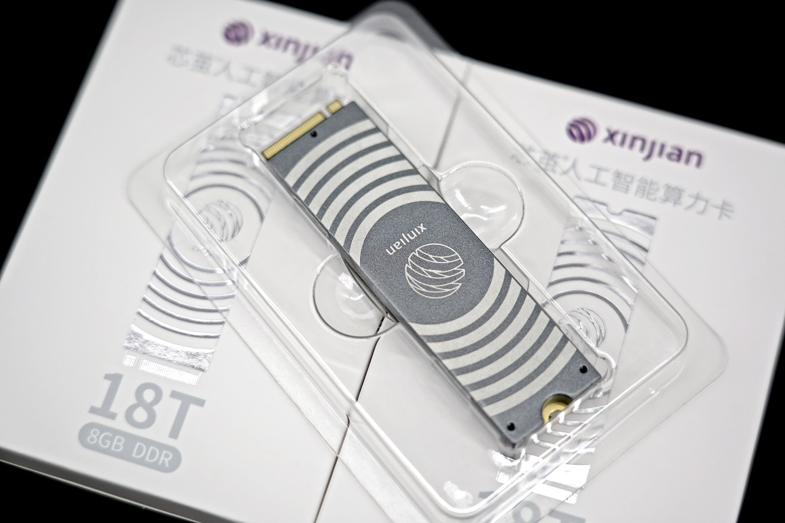

# 简介

## 概述

AXCL 是用于在 [AXERA](https://www.axera-tech.com/) 芯片平台上开发深度神经网络推理、转码等应用的 C、Python 语言 API 库，提供运行资源管理，内存管理，模型加载和执行，媒体数据处理等 API，其逻辑架构图如下图所示：

## 概念

AXCL 运行时库有 Device、Context、Stream、Task 等基本概念，其关系如下图所示：

- Device：提供计算和媒体处理的硬件设备，通过 PCIe 接口和 Host 连接。
  - Device 的生命周期源于首次调用 `axclrtSetDevice` 接口。
  - Device 使用引用计数管理生命周期，`axclrtSetDevice` 引用计数加 1，`axclrtResetDevice` 引用计数减1。
  - 当引用计数减少为零时，本进程中的 Device 资源不可用。
  - **若存在多个 Device，多个 Device 之间的内存资源不能共享**。
- Context：执行上下文容器，管理包括 Stream，内存等生命周期，Context 和应用线程绑定。Context 一定隶属于一个唯一的 Device。Context 分为隐式和显示两种：
  - 隐式 Context（即默认 Context）：
    - 调用 `axclrtSetDevice` 接口指定设备时，系统会创建一个隐式 Context，当 `axclrtResetDevice` 接口引用计数为零时隐式 Context 被自动销毁。
    - 一个 Device 只会有一个隐式 Context，隐式 Context 不能通过 `axclrtDestroyContext` 接口销毁。
  - 显示Context：
    - 调用 `axclrtCreateContext` 接口显示创建，调用 `axclrtDestroyContext` 接口销毁。
    - 进程内的 Context 是共享的，可以通过 `axclrtSetCurrentContext` 进行切换。**推荐应用为每个线程中创建和销毁显示 Context**。
- Stream：执行任务流，隶属于 Context，同一个 Stream 的任务执行保序。Stream 分为隐式和显示两种：
  - 隐式 Stream（即默认 Stream）：
    - 每个 Context 都会创建一个隐式 Stream，生命周期归属于 Context。
    - native sdk 模块（比如`AXCL_VDEC_XXX`、`AXCL_SYS_XXX`等）使用隐式 Stream。
  - 显示Stream：
    - 由 `axclrtCreateStream` 接口创建，由 `axclrtDestroyStream` 接口销毁。
    - 当显示 Stream 归属的 Context 被销毁或生命周期结束后，即使该 Stream 没有被销毁，亦不可使用。
- Task：Device 任务执行实体，应用不可见。

## 应用线程和Context

- 一个应用线程一定会绑定一个 Context，所有Device的任务都必须基于 Context。
- 一个线程中当前会有一个唯一的 Context，Context 中绑定了本线程任务执行的 Device。
- 应用线程中支持通过 `axclrCreateContext` 创建多个 Context，但一个线程同一时刻只能使用一个 Context。连续创建多个 Context，线程绑定的是最后一个创建的 Context。
- 进程内支持通过 `axclrtSetCurrentContext` 绑定当前线程的 Context，连续多次调用 `axclrtSetCurrentContext`，最终绑定的是最后一次的 Context。
- 多线程推荐为每个线程显示创建一个Context。
- 推荐通过 `axclrtSetCurrentContext` 切换 Device。

:::{tip}

   SDK axcl/sample/runtime 提供了如何在线程中创建和销毁Context的示例代码。

:::

## 参考硬件

### AX-M1

瑞莎智核 AX-M1 是一款基于爱芯元智公司 AX8850 SoC 推出的高性能 M.2 加速模组，具有高算力、高能效比等特性，专为边缘智能计算与 AI 推理应用打造。
集成多核高性能 CPU 和高算力 NPU，具备卓越的多媒体处理能力，为各类边缘 AI 场景提供高效、灵活的硬件支撑。

**产品图片**

**产品规格**

|              | 描述                                                    |
| ------------ | ------------------------------------------------------- |
| CPU       | 八核 Cortex-A55，主频高达 1.5GHz                            |
| 内存         | 8GB LPDDR4x                                             |
| NPU         | 24TOPS@INT8；支持矩阵运算单元和智能视觉引擎                 |
|              | 支持 CNN、Transformer 模型部署，支持 LLM、VLM 部署      |
| VPU        | 支持 H.264/H.265 8K@30fps编解码和 16 路 1080p@30fps 解码  |
| 视频解码     | H.264/H.265，32路 1080@30fps 解码                       |
| 硬件适配	     | 支持 Intel、AMD、Rockchip 等主机平台                    |
| 系统适配	     | 支持 Ubuntu、Debian、CentOS 等主流 Linux 发行版         |
| 外形尺寸     | M.2 2280，M Key                                         |
| 工作电压     | 3.3 V                                                   |
| 系统功耗	    | ≤ 8W                                                   |
